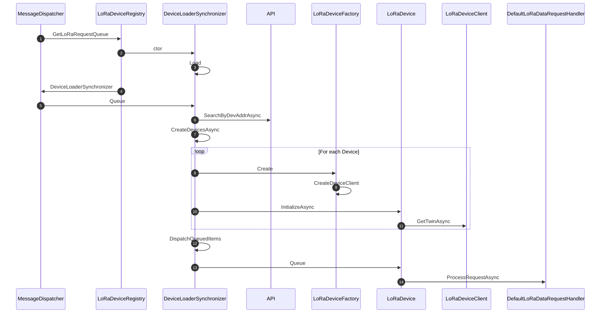
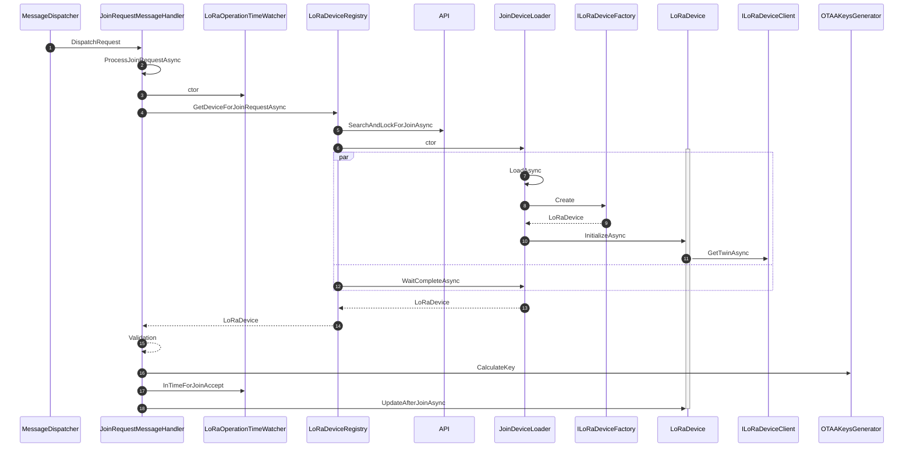
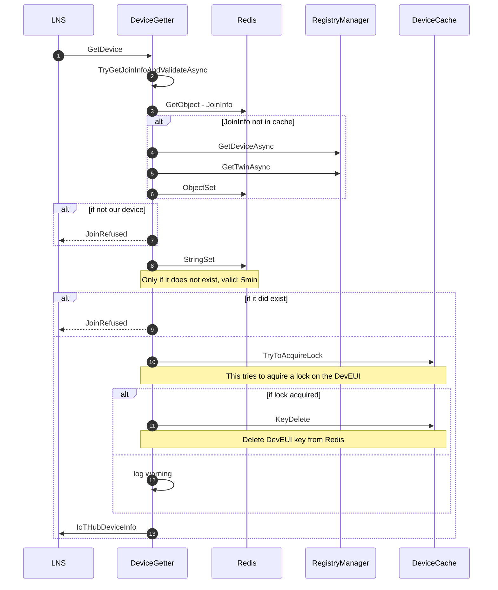

# Message Flows

## DefaultLoRaDataRequestHandler:ProcessRequestAsync

````mermaid
flowchart TB
ProcessRequestAsync-->ReqVal{IsValidRequest?}
ReqVal-->|Yes|PerformADR
ReqVal-->|No|Done
PerformADR-->DedupDrop{MultiGW & Drop?}
DedupDrop-->|Yes|Done
DedupDrop-->|No|ReqConf{Requires confirmation?}
ReqConf-->|No|HasValidFctUp{Has valid fcnt down?}
ReqConf-->|Yes|HasFctDown
HasFctDown-->|No|Done
HasFctDown-->|Yes|HasValidFctUp{Has valid fcnt up?}
HasValidFctUp-->decryptPayload[decrypt payload]
decryptPayload-->IsMacAnswer{Is Mac answer?}
IsMacAnswer-->|Yes|ValidFctDwn{Has valid fct down?}
ValidFctDwn-->|No|Done
ValidFctDwn-->|Yes|CheckSendDeviceEvt
IsMacAnswer-->|No|DecodePayload
DecodePayload-->C2DMsg{Has C2D msg?}
C2DMsg-->|Yes|CheckSameDevice{Is for same device?}
CheckSameDevice-->|Yes|ValidFctDwn2{Has valid fcnt down?}
ValidFctDwn2-->|Yes|CheckSendDeviceEvt
ValidFctDwn2-->|No|C2DAbandonAsync
C2DAbandonAsync-->CheckSendDeviceEvt
CheckSameDevice-->|No|SendC2DClassC
SendC2DClassC-->CheckSendDeviceEvt
C2DMsg-->|No|CheckSendDeviceEvt{Should send event upstream?}
CheckSendDeviceEvt-->|Yes|SendDeviceEventAsync
SendDeviceEventAsync-->ValidateTime{Still time for Rx Wnd?}
CheckSendDeviceEvt-->|No|ValidateTime
ValidateTime-->|No|Done
ValidateTime-->|Yes|ConfirmDirect{Confirmation and no downlink or not enough time?}
ConfirmDirect-->|Yes|SendDownlinkMsg
ConfirmDirect-->|No|ifC2DFromDecoder{C2D msg from decoder?}
ifC2DFromDecoder-->|Yes|SendDownlinkMsg
ifC2DFromDecoder-->|No|fetchC2D
fetchC2D-->RequiresConfirmation{Requires confirmation?}
RequiresConfirmation-->|Yes|check2ndC2DTime{Enough time for 2nd C2D msg?}
RequiresConfirmation-->|No|ValidFctDwn3{Has valid fcnt down?}
ValidFctDwn3-->|Yes|check2ndC2DTime
ValidFctDwn3-->|No|Done
check2ndC2DTime-->|Yes|CheckAdditionalMessages
CheckAdditionalMessages-->additionalC2DMsg{Has more messages?}
additionalC2DMsg-->|Yes|setFpending[set fpending]
setFpending-->SendDownlinkMsg
check2ndC2DTime-->|No|SendDownlinkMsg
SendDownlinkMsg-->Done(Done)


````


## Incoming message - device not cached



1. The message dispatcher requests the `ILoRaDeviceRequestQueue` from the `LoRaDeviceRegistry` where the `LoRaRequest` can be sent to. The `LoRaDeviceRegistry` maintains an in memory cache per `DevAddr` and checks, if it has a cache and if it contains a valid device matching the `NwkSKey`.  If it does not, the `LoRaDeviceRegistry` initializes a ` DeviceLoaderSynchronizer` as `ILoRaDeviceRequestQueue`, and adds it to its cache under the prefix `devloader`.
2. The `DeviceLoaderSynchronizer` ctor does trigger an async initialization
3. Load of the devices matching the `DevAddr` is triggered
4. The `MessageDispatcher` receives the `DeviceLoaderSynchronizer` 
5. The original `LoRaRequest` is put onto the queue where it will wait for the device to be loaded.
6. The `SearchByDevAddrAsync`  is calling the function and tries to get a list for that particular `DevAddr` . The result is a list of `IoTHubDeviceInfo` which contains everything required to connect the device to IoT Hub as well as the `NwkSKey`.
7. The `DeviceLoaderSynchronizer` iterates over the result and asks for each of the result item to be materialized into a `LoRaDevice`.
8. The `LoRaDeviceFactory` creates a `LoRaDevice` from the `IoTHubDeviceInfo` 
9. The `LoRaDeviceFactory` also maintains the connections per device to IoT Hub. It does that through the `LoRaDeviceClientConnectionManager` where `LoRaDeviceClient` are registered per `DevEUI`. 
10. Each device is initialized to get ready for processing messages
11. The initialization is triggering the load of the twins through the `LoRaDeviceClient`
12. Once the device is initialized, the messages for the device are dispatched 
13. The dispatch is putting them on the `LoRaDevice` Queue
14. The `LoRaDevice` will process the messages in sequence to avoid contention on the device connection and delegate the processing to the `ILoRaDataRequestHandler`.

### Observations

1. If the `DevAddr` does not match any of our registered devices, we keep the `DeviceLoaderSynchronizer`  in cache for 30s (which is designed to ensure that pending requests that were already on the queue, can be processed), then it's evicted.  Subsequent messages after those 30s with the same `DevAddr` will keep going back to the functions API. Given the fact that a device could be registered between messages, I don't see a way to avoid that except if we are willing to accept a longer period until we recognize a device. In that case we could register a 'drop' queue for the `DevAddr` that will be evicted after a longer time.

## Incoming message - device cached

````mermaid
sequenceDiagram
autonumber
MessageDispatcher->>LoRaDeviceRegistry: GetLoRaRequestQueue
alt in cache but not our device
	LoRaDeviceRegistry->>MessageDispatcher:ExternalGatewayLoRaRequestQueue:ctor
else
	LoRaDeviceRegistry->>MessageDispatcher:cached LoRaDevice
end
MessageDispatcher->>LoRaDevice: Queue
LoRaDevice->>DefaultLoRaDataRequestHandler: ProcessRequestAsync
````

1. The message dispatcher requests the `ILoRaDeviceRequestQueue` from the `LoRaDeviceRegistry`
2. If the device was in cache, but does not belong to our gateway, we return a `ExternalGatewayLoRaRequestQueue`. That queue is basically dropping any messages that are sent to it.
3. If the device was found in the cache we return that to the `MessageDispatcher`.
4. The request is put onto the `LoRaDevice`'s queue.
5. The `LoRaDevice` will process the messages in sequence to avoid contention on the device connection and delegate the processing to the `ILoRaDataRequestHandler`.

## Join Request - OTAA




1. The `MessageDispatcher` delegates the handling of the join request to the `JoinRequestMessageHandler`

2. The `JoinRequestMessageHandler` is executing `ProcessJoinRequestAsync` and extracts: DevEUI, AppEUI and DevNonce from the join request.

3. A `LoRaOperationTimeWatcher` is created to monitor the elapsed time for the join request.

4. The `LoRaDeviceRegistry` is queried for the device matching the join request.

5. The `LoRaDeviceRegistry` is asking the functions API to lookup the device using the DevEUI, AppEUI and the DevNonce. Also the Gateway Id is sent to allow locking the join request.  see the [GetDevice flow](#function-GetDevice---OTAA)

   1. Q: why do we send the **AppEUI**? It looks like that's not used for the OTAA join?

6. `LoRaDeviceRegistry` creates a new `JoinDeviceLoader` (unless the loader is still in the cache - valid for 30min) passing in the `IoTHubDeviceInfo`.

7. The `ctor` of the `JoinDeviceLoader` starts a thread executing `LoadAsync`

8. A new `LoRaDevice` is created through the factory from the `IoTHubDeviceInfo`

9. `LoRaDevice` is returned.

10. The `LoRaDevice` is initialized.

11. Twins are loaded through the `ILoRaDeviceClient` (keys were fetched from the API).

12. `JoinDeviceLoader` is waiting for completion of the device load process

13. The `LoRaDevice` is returned to the `LoRaDeviceRegistry`

14. The `LoRaDevice` is returned to the `JoinRequestMessageHandler`

15. Validation of the join request is performed (CheckMic, DevNonce, GatewayID)

16. Keys are generated

17. Validate that we can confirm the join to the device and are within `Join_accept_delay2` for the current region.

18. Writing `DevAddr`, `NwkSKey`, `AppSKey`, `AppNonce `, `DevNonce`, `NetID`, `Region`, `PreferredGatewayID`

19. If we are still in time for a valid receive window, a `JoinAccept` will be sent to the device after calculating the DR and Frequency.

    

## Function GetDevice - OTAA




1. The LNS requests the device for a [join request](#Join-Request---OTAA)

2. The DeviceGetter calls `TryGetJoinInfoAndValidateAsync`

3. Try to get the `JoinInfo` (containing the primary key and the desired gateway id for the device) from Redis. 

4. If the device was not in the cache, we use the IoT Hub  `RegistryManager` to fetch the Device

5. If the device exists, we fetch the twins and get the Desired GatewayId.

6. The JoinInfo is stored in Redis for 60min

7. We validate that if there is a desired gateway, the gateway processing the join request, is the desired gateway. If not, a BadRequest is returned to the LNS indicating the join failure.

8. We try to set the DevEUI:Nonce value in Redis cache to ensure, only 1 Gateway is processing the join request

9. If we did not win the race, the Gateway receives a BadRequest response

10. If we were successful we create a `IoTHubDeviceInfo` and try to acquire a lock on the DevEUI

11. If we did get the lock, we delete the DevEUI key.

12. If not, we print out a warning

13. We return the `IoTHubDeviceInfo`


**Bug?**: It looks like we do not store anything ever under the DevEUI key. The invalidation of the cache looks like it should have targeted the the DevAddr hash table and removed the entry from there. That would enforce to re-fetch the information from the twins after a re-join.

