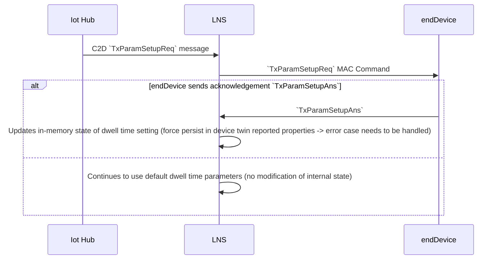

# 004. Region AS923 implementation

Milestone / Epic: [#412](https://github.com/Azure/iotedge-lorawan-starterkit/issues/412)

Authors: Maggie Salak, Bastian Burger

## Overview / Problem Statement

The specification of region AS923 defines a `AS923_FREQ_OFFSET` parameter which is used to accommodate different country-specific sub-bands across the 915 - 928 MHz band. The parameter can have one of four different values depending on a country. The corresponding frequency offset in Hz is `AS923_FREQ_OFFSET_HZ = 100 x AS923_FREQ_OFFSET`. The value of the parameter is needed for the purpose of calculating RX2 window frequencies for AS923 region. The parameter is not required for calculating RX1 receive window as it simply uses the same channel as the preceding uplink.

In addition to sub-bands and frequency offsets, the [regional parameter specification][rp2-103] describes noteworthy behavior with respect to dwell times. The dwell time describes the time needed to transmit a LoRaWAN message, typically restrictions limit the dwell time to be not longer than 400ms. For the AS923 region, the specification says that dwell time limitations may apply to some locations in the AS923 region depending on local regulations. We are not able to get a comprehensive list of which locations use which regulations. To ensure conformity with these limitations, each gateway can configure an end device using `TxParamSetupReq/Ans` MAC commands. A typical flow may look like this:

- End device sends join request using DR2 - DR5 (which always complies with potential dwell time limitations of 400ms)
- The actual dwell time limitations are communicated by the gateway to the device using a downstream `TxParamSetupReq` MAC Command
- End device sends `TxParamSetupAns` MAC Command with empty payload as acknowledgement
- Both end device and gateway adhere to the limitations from there on

With the LoRaWAN specification 1.0.3, the `TxParamSetupReq/Ans` MAC Command exchange [is subject to a bug if the `TxParamSetupAns` is lost][dwell-time-bug], which leaves the end devices unable to receive downlink messages. The bug will only be fixed in LoRaWAN specification version 1.0.4.

This document summarizes decisions taken for the purpose of implementing support for region AS923.

## In-Scope

- Support for all countries using frequency plan AS923
- Calculation of RX1 downstream frequencies and data rates
- Calculation of RX2 receive window
- Dwell time support

## Out-of-scope

- MAC commands - support will be added later on as part of [#414](https://github.com/Azure/iotedge-lorawan-starterkit/issues/414)
- Adaptive Data Rate - support will be added later on as part of [#415](https://github.com/Azure/iotedge-lorawan-starterkit/issues/415)
- FOpts - it is not yet clear whether this parameter needs to be used, this is tracked for all regions as part of user story [#717](https://github.com/Azure/iotedge-lorawan-starterkit/issues/717)

## Decision

### Frequency offsets

The `AS923_FREQ_OFFSET` parameter can be calculated based on the channel 0 and channel 1 frequencies in the LoRa Basics Station configuration. The corresponding channels for region AS923 are defined as follows:

`Channel 0 frequency Hz = 923200000 + AS923_FREQ_OFFSET_HZ`
`Channel 1 frequency Hz = 923400000 + AS923_FREQ_OFFSET_HZ`

Using this formula we will calculate the offset by subtracting 923200000 from the configured channel 0 frequency. We will use the formula for channel 1 frequency to validate the offset value and throw and exception if values are not the same.

In the implementation of region AS923 the frequencies for channel 0 and 1 will be passed to the region-specific constructor where the offset value will be calculated.

### Dwell Times

tbd

## Appendix

### Dwell times

We discuss different approaches to handle dwell time limitations.

#### No `TxParamSetupReq` support

If we do not support the `TxParamSetupReq` MAC Command as part of the initial version of the AS923 region implementation. One implication is that the maximum Equivalent Isotropically Radiated Power (EIRP), which is normally configurable through `TxParamSetupReq`, will be static and non-configurable. We introduce a Boolean configuration value in the concentrator device twin that specifies whether a dwell time limitation applies to that concentrator. Based on this configuration value, the gateway will apply a different set of regional parameters, which take the dwell time limitations into account. It will be the responsibility of the starter kit user to ensure that end devices are configured with the same dwell time settings as the concentrator to which they are connected, as it will not be automatically propagated to the end device through `TxParamSetupReq`.

Pros:

- Easy to implement

Cons:

- End devices (e.g. by Netvox) cannot be updated with different dwell time limitation defaults after shipping. If local regulations change, such devices cannot be used any longer with the starter kit
- Static EIRP

#### Manual dwell time management

The user configures the dwell time settings on a device-per-device basis by issuing a C2D messages, which gets translated to a `TxParamSetupReq` MAC command. Updating which dwell time setting is used happens as a separate manual step after the device settings were successfully updated. The flow looks as follows:

- The user issues a `TxParamSetupReq` through a C2D message to change the dwell time limitations on the end device
- The user (manually) checks whether the device picked up the correct dwell time limitations
- The user (manually) updates the device twin desired properties with the actual dwell time limitation flag
  - Either the user (manually) needs to refresh all gateway caches and Redis or we only allow single gateway or OTAA joins
- The LNS fetches the desired properties from the device and uses a set of regional parameters based on the dwell time settings

Pros:

- Relatively simple to implement

Cons:

- A lot of manual steps involved/cumbersome for the user
- Does not resolve bug [if the `TxParamSetupAns` is lost][dwell-time-bug] and the user does not have access to the serial output of the device
- Messages between successful C2D `TxParamSetupReq` transmission and device cache refresh might have inconsistent dwell time settings

#### Semi-automatic dwell time management

The user configures the dwell time settings on a device basis by issuing a C2D messages, which gets translated to a `TxParamSetupReq` MAC command. After the MAC command was sent, the LNS waits for the `TxParamSetupAns`. Based on whether the MAC answer was received, the LNS updates the reported properties of the device twin and conditionally applies regional parameters based on the dwell time setting (e.g. for the receive window channels). A visualization for this flow looks as follows:

Pros:

- Easiest solution of the three for the user

Cons:

- Complexity
- Does not resolve bug [if the `TxParamSetupAns` is lost][dwell-time-bug]
- Works only for single gateway or OTAA join, multi-gateway would be more complex (if we decide to implement it)

[dwell-time-bug]: https://github.com/Lora-net/LoRaMac-node/issues/614
