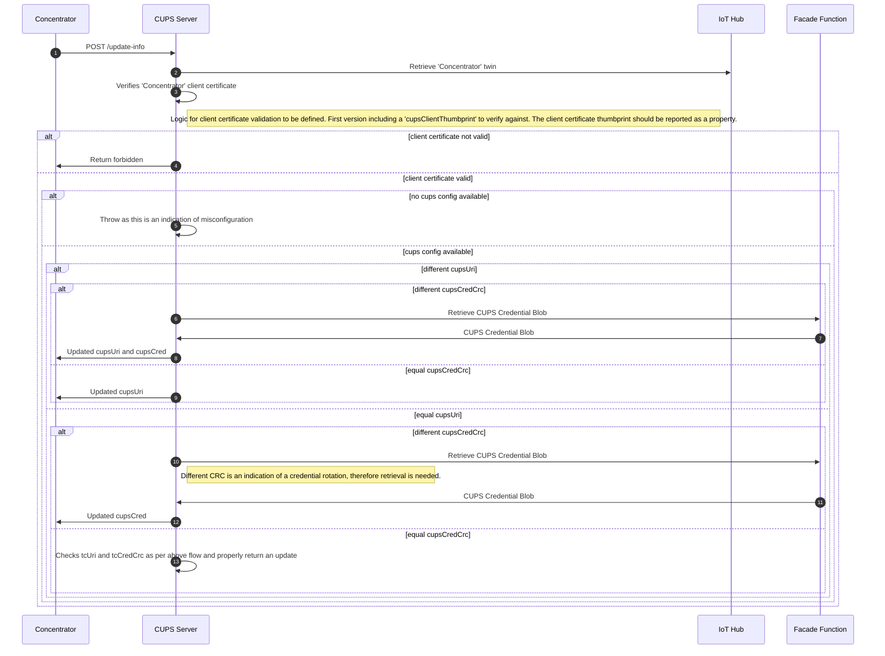
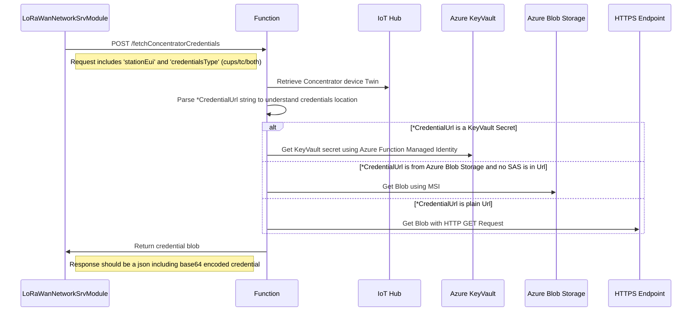

# 006. CUPS Protocol Implementation - Credential management

**Feature**: [#391](https://github.com/Azure/iotedge-lorawan-starterkit/issues/391)

**Date**: 19 November 2021

**Author**: Daniele Antonio Maggio

**Status**: Proposed

__________

## Overview

LoRa Basics™ Station defines a CUPS protocol for providing updated LNS/CUPS credentials and generic update data binary to any Client connecting to a CUPS Server.

More information on the protocol can be found [here](https://doc.sm.tc/station/cupsproto.html).

## In-scope

This document focuses on:

- Defining a flow diagram for common credential management scenarios:
  - First connection
  - Certificate rotation process
- Defining the changes needed in IoT Hub for handling Basics Station specific information
- Defining the changes needed in 'Facade' Azure Function for handling updated credential retrieval
- Defining the changes needed in LoRaWan Network Server for handling above mentioned flows
- Defining the changes needed in LoRa Device Provisioning CLI for handling creation/update of concentrators with certificate support

## Out-of-scope

Out of scope for this document is:

- Defining a flow diagram for firmware update process
- Defining any change needed in IoT Hub / Azure Function / Network Server for handling firmware updates

## Authentication mechanisms with LoRa Basics™ Station

### Context

To better understand how the CUPS Protocol should be implemented, it is needed to understand how Basics Station is handling authentication.

LoRa Basics™ Station supports four different authentication modes:

- No Authentication
- TLS Server Authentication
- TLS Server and Client Authentication
- TLS Server Authentication and Client Token

An authentication mode can be set by configuring some files in the device where Basics Station is going to be executed. More documentation [here](https://doc.sm.tc/station/credentials.html)

Basics Station can either use two different sets of credentials for achieving client authentication to the CUPS endpoint and to the LNS endpoint or re-use the same set of credentials for both.

The aim of this document section is to take and record a decision for:

- Which authentication mode needs to be used for connecting to CUPS endpoint
- Which authentication mode needs to be used for connecting to LNS endpoint
- Where are the certificates stored and how to retrieve those?

### Decision(s)

Out of the four authentication modes we should aim for "TLS Server and Client Authentication" for both CUPS and LNS endpoints.

Driving this decision is the willing of increasing the overall security of the system.

In order to keep the starter kit simple, the same set of server and client credentials are to be used for both CUPS and LNS protocol endpoints.

For the same simplicity reason, credential bundles are going to be stored in an Azure Storage Account.

### Authentication to CUPS endpoint

The CUPS endpoint should support mutual TLS authentication between client (basic station) and server (network server IoT Edge module).

If not manually disabled via flags, for increased security, the server has to "require" client authentication and verify the provided credentials.

Therefore, in order for Basic Station to connect to the CUPS HTTPS endpoint the following files should be provided to the station:

- cups.uri
- cups.crt (including the certificate in PEM format)
- cups.key (including the EC Private Key for the child certificate)
- cups.trust (including the chain of trust certificate for the server-side certificate)

You may find an example on how to generate all the needed certificates in [this script](https://github.com/lorabasics/basicstation/blob/master/examples/cups/prep.sh) from the Basic Station official GitHub repository.

### Authentication to LNS endpoint

As for CUPS, the LNS endpoint should support mutual TLS authentication between client (basic station) and server (network server IoT Edge module).

For increased security the server should "require" client authentication and verify the provided credentials.

Therefore, in order for Basic Station to connect to the LNS WSS endpoint the following files should be provided to the station:

- tc.uri (i.e.: "wss://LoRaWanNetworkSrvModule:5001")
- tc.crt (including the certificate in PEM format)
- tc.key (including the EC Private Key for the child certificate)
- tc.trust (including the chain of trust certificate for the server-side certificate)

As stated in the decision section above, same certificate files as CUPS certificates above are expected to be used for the Starter Kit.

There is no need to copy/paste manually these files in the Basic Station; the CUPS Protocol Implementation later described in this document will retrieve the needed credentials from a centralized repository and update the Basic Station configuration when it starts. This option is also providing an option to rotate certificates when these are near the expiration.

### Where to store certificates

There are multiple options of where to store the `cups.{trust,cert,key}` and `tc.{trust,cert,key}` bundle files.

As stated above, for the same simplicity reason, credential bundles are going to be stored in an Azure Storage Account.

#### a. Azure Storage Account

This is the easiest option for a new user of the Starter Kit, even though it's not the safest one.

When deploying the Starter Kit, an Azure Storage Account is provisioned for Azure Functions.

LoRa Device Provisioning tool should be capable of uploading the CLI provided bundle files and properly update the twin for the concentrator device being created in IoT Hub.

When using this option, the 'Facade' Azure Function will retrieve certificate files from such storage account.

#### b. Azure Key Vault secret

This option requires more manual intervention, as the LoRa Device Provisioning tool is not adapted for uploading the credential bundle files to an Azure Key Vault instance.

Following the documentation on [how to set a secret in Azure Key Vault](https://docs.microsoft.com/en-us/azure/key-vault/secrets/quick-create-portal), you can just create two secrets and retrieve their URLs.

When setting a Key Vault secret in the concentrator twin "cups" section, the 'Facade' Azure Function will retrieve it using a Managed Identity.

#### c. External HTTPS repository

This option requires most manual intervention.

LoRa Device Provisioning tool is not uploading the credential bundle files to the repository.

'Facade' Azure Function can handle a HTTPS endpoint from where the bundles will be downloaded, even though there is no security check or additional AuthN/AuthZ option provided here.

## CUPS Protocol Implementation

### Flow diagram for credential management scenarios

#### Prerequisites

- LoRa Basics™ Station is configured with a cups.uri, a cups.trust and mandatory cups.cert/key
- The concentrator device twin should include changes as described in following section

#### Flow



### IoT Hub related changes

Only change is related to the concentrator device twin.

The following "desired" properties should be properly set:

```json
"cups": {
    "cupsUri": "https://IP_or_DNS:PORT",
    "tcUri": "wss://IP_or_DNS:PORT",
    "cupsCredCrc": INT,
    "tcCredCrc": INT,
    "cupsCredentialUrl": "https://...",
    "tcCredentialUrl": "https://..."
},
// Following field to be used for first version client certificate validation
"clientThumbprint": [ "Client certificate thumbprint" ]
```

- **'cupsCredCrc'**: should be computed as CRC32 checksum calculated over the concatenated credentials files `cups.{trust,cert,key}`
- **'tcCredCrc'**: should be computed as CRC32 checksum calculated over the concatenated credentials files `tc.{trust,cert,key}`
- **'cupsCredentialUrl'**: should point to the blob/secret containing the concatenated credentials `cups.{trust,cert,key}`
- **'tcCredentialUrl'**: should point to the blob/secret containing the concatenated credentials `tc.{trust,cert,key}`
- **'clientThumbprint'**: should include the thumbprint of the client certificate used for authenticating against the CUPS server. It is an array for allowing an old thumbprint to be accepted until the rotation mechanism completes

### Facade Azure Function related changes

The Azure Function should implement a new endpoint 'FetchConcentratorCredentials' which executes the following flow:



In addition to this, the Azure Function must be able to properly authenticate to target sink via Managed Identity (when using Azure Blob Storage or KeyVault).

Considering that the default sink for the starter kit should be an Azure Storage Account, the template for the starter kit should be changed in such a way that a new Blob Container is created for uploading credential blob files.

If using KeyVault secrets instead of Blob Storage, instructions on how to create a role assignment should be provided.  

### LoRaWan Network Server changes

- LoRaDeviceAPIServiceBase and its implementation (LoRaDeviceAPIService) should include a method for calling the 'FetchConcentratorCredentials' endpoint
- IBasicsStationConfigurationService and its implementation (BasicsStationConfigurationService) should include a method for retrieving and parsing "cups" desired property in concentrator device twin
- BasicsStationNetworkServerStartup should include a new endpoint for handling CUPS '/update-info' POST requests
- BasicsStationNetworkServer should implement a basic client certificate validation when configuring kestrel
- A new CupsProtocolMessageProcessor class is implemented for achieving purposes of above drawn sequence diagram.

### LoRa Device Provisioning CLI changes

The CLI should be changed in order to:

- Specify if the device being created is making use of CUPS or not
- In case a device being created is making use of CUPS, the tool should:
  - accept as input a cupsCredentials file (being the concatenation of `cups.{trust,cert,key}`)
  - accept as input a tcCredentials file (being the concatenation of `tc.{trust,cert,key}`)
  - accept as input a clientThumbprint string (for client certificate validation)
  - compute the CRC32 of above mentioned files
  - create a device for the concentrator
  - upload, via Azure Blob Storage C# SDK, the credential files to the Blob Storage
  - update the Twin for the concentrator device accordingly
- In case a device being created is not making use of CUPS, tool should provide a `--no-cups` option, allowing to just specify a `clientThumbprint` (for client certificate validation on LNS endpoint)
- In case a device is already created and a credential rotation is required, the tool should:
  - provide a "update" mechanism that:
    - accept as input a cupsCredentials file (being the concatenation of `cups.{trust,cert,key}`)
    - accept as input a tcCredentials file (being the concatenation of `tc.{trust,cert,key}`)
    - accept as input a clientThumbprint string (for client certificate validation). New thumbprint is appended to the existing one.
    - compute the CRC32 of above mentioned files
    - create a device for the concentrator
    - upload, via Azure Blob Storage C# SDK, the credential files to the Blob Storage
    - update the Twin for the concentrator device accordingly
  - provide a "revoke" mechanism that:
    - accept as input an old clientThumbprint to be removed from the twin
    - check that reported thumbprint property is not equal to the thumbprint that we want to remove (this means that the basic station has not rotated certificate yet)

## Appendix

### Generating the certificates

For generating both server and client certificates there are two options.

#### a) With an external PKI

In this starter kit, we are assuming that the same server certificate is used for both CUPS and LNS endpoints.

Using instructions at ['Basics Station credentials management'](../user-guide/station-credential-management.md) page, copy the certificate so that the LoRaWan Network Server can retrieve it at its startup and use it within Kestrel.

For concentrator configuration, it is important to retrieve the chain of trust which is used for signing the CUPS/LNS server certificate.

This trust file needs to be:

- placed as `cups.trust` in the Concentrator BasicStation configuration folder
- stored in KeyVault/Blob Storage, using the provisioning tool, to be later retrieved from CUPS Server and transferred to BasicStation running on concentrator device (as `tc.trust`)

Regarding client authentication instead, to generate a concentrator specific certificate, you have two options:

- If your device is powerful enough to run OpenSSL:
  - Generate a key and a certificate sign request
  - Sign the request by using the PKI
  - 'Install' the cups.cert/key and tc.cert/key on the concentrator
  - Populate cupsCredCrc and tcCredCrc of the concentrator twin:
    - either by manually calculating the CRC32 checksum of the concatenation of `cups.{trust,cert,key}` and `tc.{trust,cert,key}` (same file is expected for both cups and tc in the starter kit)
    - by using the device provisioning tool

- If the device is not powerful enough and it's only providing you the ability to upload the .crt/.key bundle, you will have to execute the steps from previous option while generating the key and the certificate sign request on a different device

#### b) Without an external PKI

In this starter kit, we are providing some bash scripts to generate a self-signed root certificate and certificates for server/client authentication.
