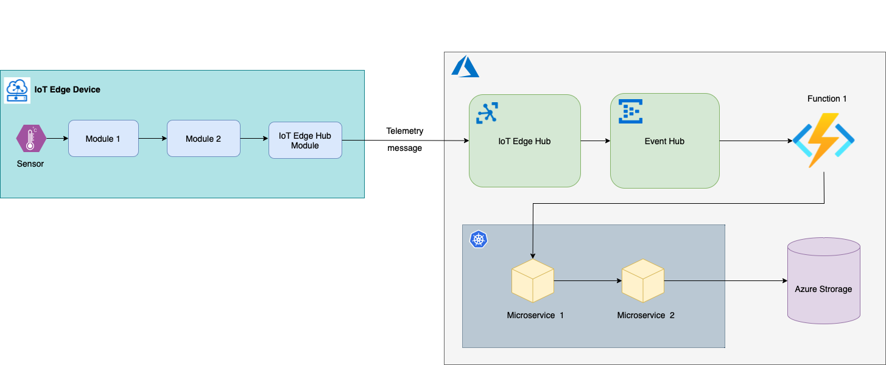

# Distributed Tracing with IoT Edge

## Challenge

Processing of telemetry data coming from an edge device may include multiple running pieces. For example: sensor->module 1->module-2>IoT Hub->function 1->microservice 1->microservice 2->storage.

While diagnosing and troubleshooting a problem such as "the data didn't arrive to the storage" or even worse "the data arrived but it's not what was expected", it's hard to "trace" how the data was traveling and what was happening at every single station. Hence distributed "tracing".

As a matter of fact, in many cases we know how the data was traveling as the flows are mostly straight forward, but we don't know what was happening at every point in the flow when this specific data was processed. This is the real challenge.

In IoT world the solution is getting more complicated as the flow consists of two parts: device and the cloud. While the flow steps in the cloud always have a direct access to the cloud tracing services (App Insights) and can flush their tracing data just on-the-fly, the steps happening in the device don't have this privilege as they are often offline and connection to the cloud service is very limited/restricted.

Besides the standard use-case of sending telemetry data from devices to the cloud, there are other scenarios which would also benefit from distributed tracing functionality:

- Device-to-cloud file upload
- Cloud-to-device messages
- Cloud-to-device direct method invocation
- Direct access to external/cloud services from the device

## IoT Hub offering

There is a single resource that touches distributed tracing with IoT Hub: [Trace Azure IoT device-to-cloud messages with distributed tracing](https://docs.microsoft.com/en-us/azure/iot-hub/iot-hub-distributed-tracing).

The preview IoT Hub feature which is described in the guidance is supposed to do the following:

  - On message arrival from a device, IoT Hub generates a globally unique "correlationId"
  - IoT Hub logs to Log Analytics/Event Hub a record under "DistributedTracing" category signaling that a message has arrived with DiagnosticIoTHubD2C operation.
  - When IoT Hub writes the message to internal/built-in Event Hub it logs a record under "DistributedTracing" category to signal that event with DiagnosticIoTHubIngress operation.
  - When there is a routing configured for the message and the message is written to an endpoint, IoT Hub logs a record under "DistributedTracing" category to signal that event with DiagnosticIoTHubEgress operation.

All this is supposed to work only if a device uses C SDK for the communication or constructs a message manually handling all required properties.

To summarize:

  - The "distributed tracing" feature logs three steps of a message processing inside IoT Hub.
  - These three log records are tied by generated "correlationId".

This feature [doesn't work](https://github.com/MicrosoftDocs/azure-docs/issues/84386).  The guidance is referring to [outdated/archived repo](https://github.com/MicrosoftDocs/azure-docs/issues/84282) samples that [are broken too](https://github.com/Azure-Samples/e2e-diagnostic-provision-cli/issues/12).

But even if it worked, it would cover only a tiny piece in the whole flow - internal IoT Hub message processing, which is not that interesting after all. The picture is way bigger.

## Approach

- Instrument custom modules on IoT Edge device with OpenTelemetry to report tracing.
- Instrument IoT Hub module with OpenTelemetry to report tracing. Since all communication on the device is routed through IoT Hub module this will give a lot of tracing data even without instrumenting other modules on the device. It will also help with use-cases like c2d, upload files, etc.
- The key component to route OpenTelemetry tracing data to the observability backend (e.g. App Insights, Jaeger, Zipkin, etc.) is [OpenTelemetry Collector](https://github.com/open-telemetry/opentelemetry-collector/blob/main/docs/design.md) which may work on the device as a module and in the cloud as an Azure Function or K8s microservice.
- All modules on the device should export tracing data to OpenTelemetry Collector Module via [OpenTelemetry Protocol Exporter](https://github.com/open-telemetry/opentelemetry-specification/blob/main/specification/protocol/exporter.md) (e.g. with [OTLP exporter](https://github.com/open-telemetry/opentelemetry-dotnet/blob/main/src/OpenTelemetry.Exporter.OpenTelemetryProtocol/README.md)). This decouples the module code from the details on how/where the tracing data is going to be used.
- On the devices that are mostly/normally online, the OpenTelemetry Collector Module is configured to receive traces with [OTLP Receiver](https://github.com/open-telemetry/opentelemetry-collector/blob/main/receiver/otlpreceiver/README.md) and to export traces to Azure Monitor (App Insights) via [Azure Monitor Exporter for OpenTelemetry Collector](https://github.com/open-telemetry/opentelemetry-collector-contrib/tree/main/exporter/azuremonitorexporter)
  - Alternatively, the devices that are always online (can't work otherwise) and have a stable connection with the cloud (like tin LoRaWan case) may have custom modules export tracing data directly to App Insights with [Azure Monitor OpenTelemetry exporter](https://docs.microsoft.com/en-us/azure/azure-monitor/app/opentelemetry-enable?tabs=net#enable-azure-monitor-application-insights). In this case they don't need to have OpenTelemetry Collector Module on the device.

- On the devices that may be normally offline, the OpenTelemetry Collector Module is configured to export traces to Azure Blob Storage module (an OpenTelemetry Collector exporter for that should be implemented [in this repo](https://github.com/open-telemetry/opentelemetry-collector-contrib/tree/main/exporter)). Once the module is online the traces will be replicated automatically to the storage account in the cloud. On the cloud side there is an OpenTelemetry Collector instance running and receiving traces from the storage with Azure Storage receiver (to be implemented [in this repo](https://github.com/open-telemetry/opentelemetry-collector-contrib/tree/main/receiver)) and exports traces to Azure Monitor via [Azure Monitor Exporter for OpenTelemetry Collector](https://github.com/open-telemetry/opentelemetry-collector-contrib/tree/main/exporter/azuremonitorexporter).
    - Alternatively, for the devices that are mostly offline and/or not supposed to report much to the cloud, the tracing data can be forwarded by OpenTelemetry Collector Module to an open source observability backend (e.g. Jaeger, Zipkin) using one of [available exporters](https://github.com/open-telemetry/opentelemetry-collector-contrib/tree/main/exporter).
    - Alternatively, until Azure Storage receiver for OpenTelemetry Collector is implemented, a cloud workflow could be used to import traces from Azure Storage to the OpenTelemetry Collector. A cloud workflow typically consists of Event Hub listening for traces arrival to the storage and an Azure function triggering on that event. The function uses OTLP to export traces to the collector.

- All services in the cloud, that are included in the flow may export OpenTelemetry traces to Azure Monitor with the [direct exporter](https://docs.microsoft.com/en-us/azure/azure-monitor/app/opentelemetry-overview#sending-your-telemetry) from the code or they may use OTLP to export traces to the OpenTelemetry Collector instance in the cloud. The latter covers cases when services are not implemented with one of [supported by Azure Monitor languages](https://docs.microsoft.com/en-us/azure/azure-monitor/app/platforms), for example GoLang.
- All steps in the flow (modules on the device and services in the cloud) should leverage OpenTelemetry Tracing API components such as [Span Attributes](https://github.com/open-telemetry/opentelemetry-specification/blob/main/specification/trace/api.md#set-attributes) to store deviceid, sensorid, gateway, etc. and [Span Events](https://github.com/open-telemetry/opentelemetry-specification/blob/main/specification/trace/api.md#add-events) to store essential logs that should be exported with tracing data.
- D2C and C2D messages should contain [tracing span context](https://opentelemetry.io/docs/reference/specification/overview/#spancontext) injected in the message system properties. It can be extracted and used by receiving modules and backend services to [continue the trace](https://opentelemetry.io/docs/concepts/data-sources/#traces). This may require using [Context propagation techniques](https://github.com/open-telemetry/opentelemetry-dotnet/blob/main/src/OpenTelemetry.Api/README.md#context-propagation).

## Resources

- [Trace Azure IoT device-to-cloud messages with distributed tracing](https://docs.microsoft.com/en-us/azure/iot-hub/iot-hub-distributed-tracing)
- [E2E diagnostic provision CLI](https://github.com/Azure-Samples/e2e-diagnostic-provision-cli)
- [E2E diagnostic event hub function ](https://github.com/Azure-Samples/e2e-diagnostic-eventhub-ai-function)
- [OpenTelemetry and Tracing](https://lightstep.com/blog/opentelemetry-101-what-is-tracing/)
- [OpenTelemetry Collector](https://github.com/open-telemetry/opentelemetry-collector/blob/main/docs/design.md)
- [Azure Monitor Exporter for OpenTelemetry Collector](https://github.com/open-telemetry/opentelemetry-collector-contrib/tree/main/exporter/azuremonitorexporter)
- [OpenTelemetry .Net API](https://github.com/open-telemetry/opentelemetry-dotnet/blob/main/src/OpenTelemetry.Api/README.md#introduction-to-opentelemetry-net-tracing-api)
- [Sending telemetry to Azure Monitor](https://docs.microsoft.com/en-us/azure/azure-monitor/app/opentelemetry-overview#sending-your-telemetry)

