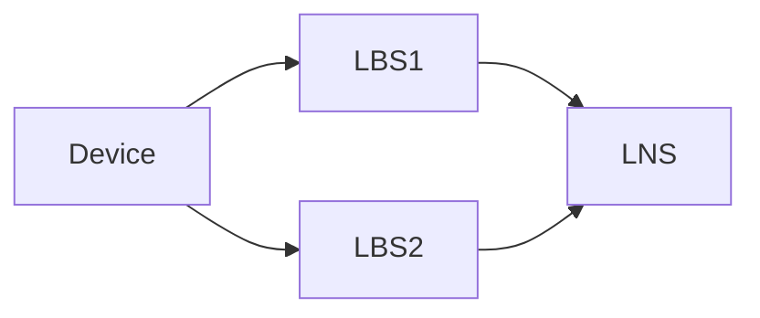
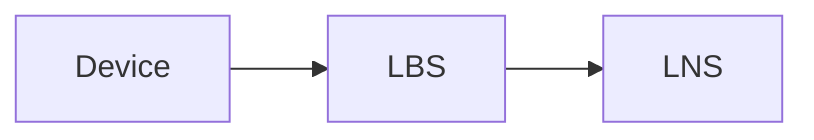
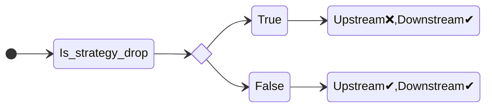
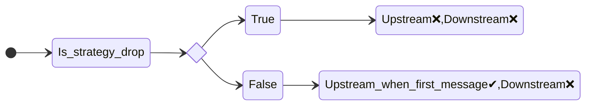
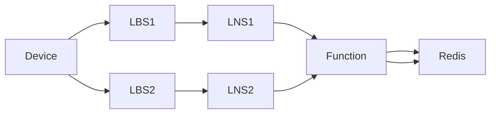

# 007. Deduplication of messages

**Feature**: [#946](https://github.com/Azure/iotedge-lorawan-starterkit/issues/946)

**Date**: 10 January 2022

**Authors**: Spyros Giannakakis, Patrick Schuler

**Status**: Accepted
__________

## Introduction

LoRaWan is a broadcast protocol. As such, a message sent from a device can be picked up by multiple
concentrators which would then pass it upstream more than once. For some use-cases, sending
upstream duplicate messages is not acceptable. With this ADR we provide an overview of the
deduplication strategies employed in the Azure IoT Edge Starterkit. The goal is also to provide
insights as to how we arrived at the current solution.

## Glossary

- (Leaf) device: a sensor that measures and transmits IoT telemetry data
- Concentrator or station - LoRa Basics Station (LBS): converts from/to LoRa messages (demodulation/modulation)
- Gateway or network server - LoRa Network Server (LNS): IoT Edge enabled device connected to IoTHub

- FrameCounter strategy: can be single or multi gateway which is also the default. In single mode
  a device is connected to a specific gateway. Any other gateway that receives messages from this
  device drops them immediately.
- Deduplication strategy: indicates how duplicate messages should be handled.
  - Drop: drops messages without further processing upstream nor downstream
  - Mark: marks messages as duplicates but allows them upstream to IoTHub. The main use-case for
    this is to triangulate the location of sensors based on the signal strength.
  - None (default): allows duplicates to pass upstream without marking them.

## Goals of the deduplication

Besides dropping duplicates correctly, we must:

- Avoid calling the Azure Function more than required to not incur extra costs or
  performance/scale overhead.
- Support existing features like Mark, resubmissions etc.

## Overview

We employ deduplication on 2 levels: on a single network server and across multiple network servers.

### 1. Deduplication on the network server level

At this level we rely on information we have locally on the network server to detect duplicates. No
calls to external services need to be made for the detection. In scope for this deduplication are:

- data messages (requiring confirmation or not)
- join requests
- Class A and C devices

For the detection, a in-memory cache is utilised with a sliding expiration of 1
minute. The value of the entry is always the concentrator from where we received the message. The
key depends on the type of message.

#### a. Data messages

The relevant fields for detection are DevAddr, Mic, payload and frame counter. Out of these a
SHA256 hash is created and stored as the key to the in-memory cache.

##### Duplicates from different concentrators

This deduplication ensures that messages coming from different concentrators connected to the same
network server are handled correctly.

The most basic topology showcasing this scenario is the following:

1. LNS receives message A from LBS1 for the first time. Message is marked as `NonDuplicate` and a
   cache entry is created.
1. LNS receives again message A this time from LBS2. LNS checks its local cache. If it's a cache
   miss, the message is marked as a `NonDuplicate` and considered as a new telemetry. This can
   happen for example if the second message takes longer than the retention period to arrive. If
   it's a cache hit, the following happens:

##### Duplicates from the same concentrator

Under special circumstances, a network server might receive the same message multiple times from the
same concentrator. These circumstances can be:

- a message that needs confirmation that was not confirmed in due time (missed window)
- a restarted device that happens to send the same measurement
- replay attacks

The most basic topology showcasing this scenario is the following:

- LNS receives message A from LBS for the first time. Message is marked as `NonDuplicate` and a
  cache entry is created where the key is a SHA256 of the message and the value is LBS.
- LNS receives again message A from the same LBS. LNS checks its local cache. If it's a cache miss,
  it's marked as a `NonDuplicate` as before. If it's a cache hit the message is marked as
  `DuplicateDueToResubmission` independently of which deduplication strategy is used.
  
#### Further processing of messages based on their duplication status

##### Short version

| Status | Upstream | Downstream |
| ---|---|--- |
| NonDuplicate | ✔ | ✔ |
| SoftDuplicate | ✔ | ❌ |
| DuplicateDueToResubmission | depends | depends |
| Duplicate | ❌ | ❌ |

where ✔ indicates that the message is processed and ❌ indicates message is dropped.

##### Longer version

If message is `NonDuplicate`: Upstream✔, Downstream✔ (if requires confirmation)  
We always want to process unique messages up and if they need to, also downstream.

If message is `SoftDuplicate`: Upstream✔, Downstream❌.  
We want to be aware of such messages on IoTHub but we skip sending downstream if they need confirmation because of possible collisions on the air.

- If message is marked as `DuplicateDueToResubmission` and it requires confirmation the following
  check happens:

- If message is marked as `DuplicateDueToResubmission` and it does not require confirmation the
  following check happens:

NB:

- For the first message (frame counter 1) we allow resending upstream because this could indicate a
  restarted device that simply sent the same measurement. The case that this happens for subsequent
  messages (framecounter > 1) within the retention period of the cache (1 minute) is unlikely and
  would more likely indicate a replay attack. These messages are dropped from the request validation
  logic.
- Since this message doesn't need confirmation, no downstream messages are sent in any case.

Finally, if message is `Duplicate`: Upstream❌, Downstream❌  
We do not want to process the message further, no calls to the Azure Function or IoTHub happen.

#### b. Join requests

Here we are detecting requests as duplicates solely based on their AppEui, DevEui and DevNonce.
If there is a cache hit (a request with the same values for these fields within the retention period
of the cache) the request is considered a `Duplicate` and dropped immediately. We are not
differentiating the cases of `SoftDuplicate` and `DuplicateDueToResubmission` here.

#### General notes

- Deduplication at this level is one of the first things that happen before a request is processed.
  We considered even moving this higher up the processing stack when we construct the LNS DTOs. The
  problem with this approach was that at that stage we don't yet have the deduplication strategy
  information. The strategy affects the decision making as we saw before and it is stored on the device
  twin which is available later on the processing stack.
- The frame counter strategy does not influence the way this deduplication works but influences the
  deduplication between network servers.
- This logic is tested with a combination of unit, integration and E2E tests.

### 2. Deduplication between different network servers

At this deduplication we ensure that duplicate messages coming from different network servers are
handled correctly. The categorization happens from an Azure Function where we need to send some
metadata of the messages.

If a device is not configured for a single gateway - no gateway assigned - we reach out
to the function to determine, if a particular message from a device was already processed.

1. Message A from Device 1 arrives at LNS 1
1. Message A from Device 1 arrives at LNS 2
1. LNS 1 calls the function
1. The function receives a lock on redis and tries to read the state of the message -
   the key is composed out of the Dev EUI and the Gateway Id
1. The last processed FcntUp is compared to the Message's FcntUp
1. We mark the request to be duplicate=false in the following cases:
   1. The incoming FcntUp is > than the cached FcntUp
   1. The incoming FcntUp is == to the cached FcntUp and the Gateway Id matches (reprocessing)
1. Other cases are considered duplicates and the result contains the processing gateway id

Once the LNS receives the result, it does apply different actions based on the deduplication
strategy selected for the device.

#### Upstream Processing

**Note**: all cases are describing the action, when receiving the information that the message is a duplicate.

1. **Drop**: Stop processing.
1. **Mark**: Mark the message "DupMsg": true.
1. **None**: Process every message without marking.

#### Downstream Processing

The downstream processing is different in that it is not depending on the deduplication strategy.
We only ever send a single downstream message, if we have to. Also this is driven by the function.
In the same process, we determine, if we are the first gateway to process the message. Only that
gateway will receive a fcnt down to confirm the message. All other gateways, will not receive
a fcnt down.
