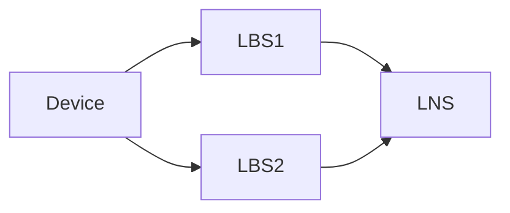
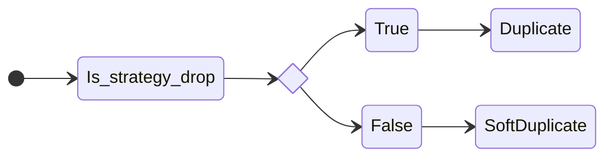
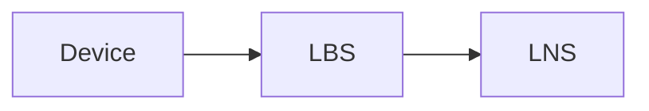
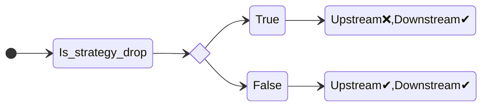
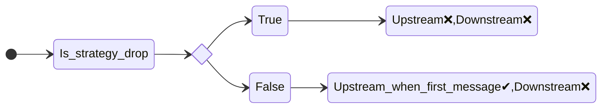

# 007. Deduplication of messages

**Feature**: [#946](https://github.com/Azure/iotedge-lorawan-starterkit/issues/946)

**Date**: 23 December 2021

**Author**: Spyros Giannakakis

**Status**: Accepted
__________

## Introduction

LoRaWan is a broadcast protocol. As such, a message sent from a device can be picked up by multiple
concentrators which would then pass it upstream more than once. For some use-cases, sending
upstream duplicate messages is not acceptable. With this ADR we provide an overview of the
deduplication strategies employed in the Azure IoT Edge Starterkit. The goal is also to provide
insights as to how we arrived at the current solution.

## Glossary

- (Leaf) device: a sensor that measures and transmits IoT telemetry
- Concentrator or station (LBS): converts from/to LoRa messages
- Gateway or network server (LNS): IoT Edge enabled device connected to IoTHub

- FrameCounter strategy: can be single or multi gateway which is the default. In the single gw mode
  a device is connected to a specific gateway. Any other gateway that receives messages from this
  device drops them immediately.
- Deduplication strategy: indicates how duplicate messages should be handled.
  - Drop: drops messages without further processing upstream nor downstream
  - Mark: marks messages as duplicates but allows them upstream to IoTHub. The main use-case for
    this is to triangulate the location of sensors based on the signal strength. 
  - None (default): allows duplicates to pass through without marking them.

## Goals of the deduplication

- Avoid calling the Azure Function if possible to not incur extra costs or
  performance/scale overhead.
- Existing features like Mark, resubmissions etc are still supported.

## Overview

We employ deduplication on 2 levels: on the network server and on the function level. 

### 1. Deduplication on the network server level

At this level we rely on information we have on the network server to detect duplicates. In scope
for this deduplication are data messages (requiring confirmation or not) and join requests from
Class A and C devices. 

#### Duplicates from different concentrators

This deduplication ensures that messages coming from different concentrators connected to the same
network server are handled correctly. Categorizing a message as a duplicate happens locally with no
call to external services.

The most basic topology showcasing this deduplication is the following:

where messages from a device are received by 2 LBSs that are connected to the same LNS.

- LNS receives message A from LBS1 for the first time. Message is marked as `NonDuplicate` and a
  cache entry is created where the key is a SHA256 of the message and the value is LBS1.
- LNS receives again Message A this time from LBS2. LNS checks its local cache. If it's a cache hit
  (i.e. the message was received within the retention period), the following happens:

If it's a cache miss, the message is marked as a `NonDuplicate`.

#### Duplicates from the same concentrator

Under special circumstances a network server might receive the same message multiple times from the
same concentrator. These circumstances can be:
- a message that needs confirmation that was not confirmed in due time (missed window)
- a restarted device that happens to send the same measurement
- replay attacks

The most basic topology showcasing this scenario is the following:

- LNS receives message A from LBS for the first time. Message is marked as `NonDuplicate` and a
  cache entry is created where the key is a SHA256 of the message and the value is LBS1.
- LNS receives again Message A from the same LBS. LNS checks its local cache. If it's a cache hit
  (i.e. the message was received within the retention period) message is marked as
  `DuplicateDueToResubmission` indendependently of which deduplication strategy is used.
  
#### Further handling of messages based on their duplication status 

| Status | Upstream | Downstream |
| ---|---|--- |
| NonDuplicate | ✔ | ✔ |
| SoftDuplicate | ✔ | ❌ |
| DuplicateDueToResubmission | depends | depends |
| Duplicate | ❌ | ❌ |

If message is `NonDuplicate`: Upstream✔, Downstream✔ (if requires confirmation)  
We always want to process unique messages up and if they need to downstream.

If message is `SoftDuplicate`: Upstream✔, Downstream❌.  
We want to be aware of such messages on IoTHub but we skip sending downstream if they need confirmation because of possible collisions on the air.

- If message is marked as `DuplicateDueToResubmission` and it requires confirmation the following
  check happens: 

- If message is marked as `DuplicateDueToResubmission` and it does not require confirmation the
  following check happens:

NB:
- For the first message (frame counter 1) we allow resending upstream because this could indicate a
  restarted device that simply sent the same measurement. The case that this happens for subsequent
  messages (framecounter > 1) within the retention period of the cache (1 minute) is unlikely and
  would more likely indicate a replay attack. These messages are dropped.
- Since this message doesn't need confirmation no downstream messages are sent.

Finally, if message is `Duplicate`: Upstream❌, Downstream❌  
We do not want to process the message further, no calls to the Azure Function or IoTHub happen.

### Deduplication between different network servers

At this deduplication we ensure that duplicate messages coming from different network servers are
handled correctly. The categorization happens from an Azure Function where we need to send some
metadata of the messages.

TODO
