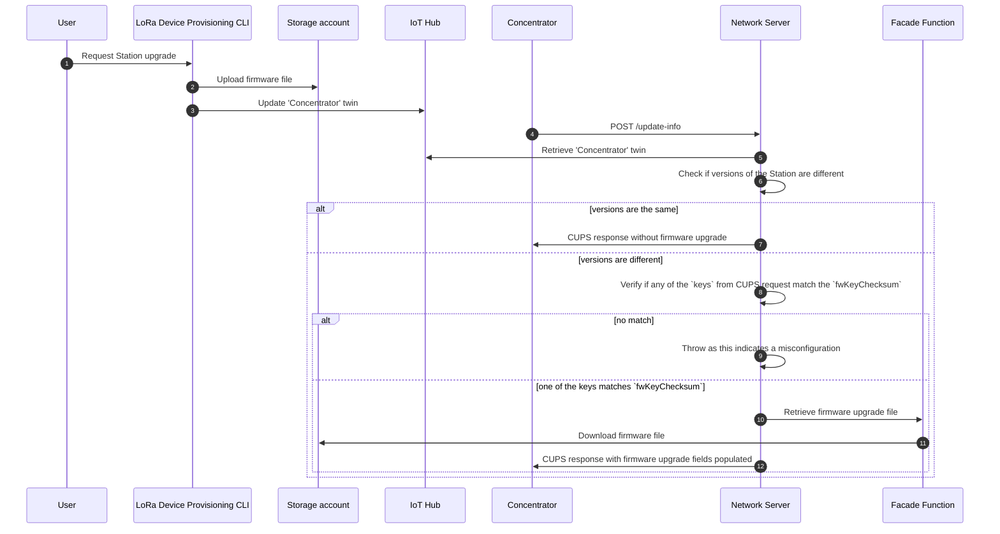

# 008. CUPS Protocol Implementation - Firmware Upgrade

**Feature**:
[#1189](https://github.com/Azure/iotedge-lorawan-starterkit/issues/1189)  

**Authors**: Daniele Antonio Maggio, Maggie Salak

**Status**: Proposed

>This ADR is an extension of [006. CUPS Protocol Implementation - Credential
>management][cups-adr] and focuses of firmware upgrades. For details about the
>general CUPS protocol implementation please refer to the other document.

## Overview

Firmware upgrades for LoRa Basics™ Station need to be supported in the CUPS
protocol implementation. More information on the protocol and parameters
exchanged between the Station and the CUPS server which are relevant to firmware
upgrades can be found in [The CUPS protocol - documentation][cupsproto].

## In-scope

This document focuses on:

- Defining a flow for executing firmware upgrades of the Basics Station
- Defining the changes needed in device twins for the concentrator station
  stored in IoT Hub for handling firmware upgrades
- Defining the changes required in the storage solution used for the CUPS
  protocol implementation
- Defining the changes needed in the Azure Function for supporting firmware
  upgrades
- Defining the changes needed in LoRaWan Network Server (LNS) for handling
  firmware upgrades
- Defining the changes needed in LoRa Device Provisioning CLI for allowing
  firmware upgrades

## Out-of-scope

- Generating of the signature key, CRC32 checksum of the signature and digest in
  the LoRa Device Provisioning CLI is considered a stretch and will not be added
  to the tool as a functionality for the time being. This document provides
  sample commands which can be used to generate required values in the appendix.

## Decisions

### Context

The CUPS request described in [The CUPS protocol - documentation][cupsproto]
contains the `package` field which indicates the current firmware version of the
Basics Station. The value will need to be updated whenever a firmware upgrade of
the Basics Station is performed by the user.

### Firmware upgrade flow

1. When provisioning a device that will need firmware upgrades, the end user
   should generate a `sig-0.key` and store it on the device and in a centralized
   repository of their own choice (example on how to generate it can be found in
   the appendix).

1. When a firmware upgrade needs to be provided to the device, the user should
   generate a digest of the executable file of the upgrade (as in examples
   mentioned above) and retrieve the CRC32 Checksum of the `sig-0.key`. Then 4
   inputs (file, digest, checksum and new version) should be provided to the
   LoRa Device Provisioning CLI tool to properly upload the file to a blob
   storage and store the needed information in the concentrator twin (blob URL
   in storage, digest, checksum and the new version number).

1. The Basics Station sends the CUPS request containing the currently used
   version (in the `package` field).

1. The LNS compares the values from the device twin and the CUPS request, and
   determines if an upgrade is required. If that's the case, the LNS will
   download the upgrade file from storage and send a properly populated response
   to the Basics Station.

1. The Basics Station will then execute the actual firmware upgrade.



### IoT Hub related changes

Only change is related to the concentrator device twin.

In addition to the values already stored in the twin, the following need to be
added:

```json
"cups": {
  // ...
  "package": "1.0.1",
  "fwUrl": "https://...",
  "fwKeyChecksum": 123456,
  "fwSignature": "..."
}
```

- **'package'**: desired package version of the Station (matching what will be
  extracted as version.txt file during update)
- **'fwUrl'**: URL pointing to the storage location of the file required to run
  the upgrade
- **'fwKeyChecksum'**: checksum of the key used to sign the digest of the
  firmware upgrade file
- **'fwSignature'**: signature of the uploaded firmware upgrade file (as base64
  encoded string)

### Storage related changes

We will use the same storage solution as the one selected for the general CUPS
protocol support (storage account). A new container named `"fwupgrades"` will be
used to store the firmware upgrade files.  The file names will be in the format
`"{stationEui}-{package}"` (without any extension, as anyways these are going to
be downloaded as `update.bin` from the Basics Station executable).

### Azure Function related changes

A new endpoint will be added in the Facade Azure Function which will be used to
fetch firmware upgrade files from the storage account. The endpoint will accept
the `StationEui` as input, then retrieve the concentrator twin from IoT Hub,
download the firmware file from the storage account and send it back in the
response.

This mechanism will have a theoretical limit of 100MB for the firmware upgrade
(as we cannot process more with Azure Function). This should be enough given the
size of the Basics Station executable (around 1MB at the time of writing this
document).

### Changes in the LoRaWan Network Server

The implementation of `CupsProtocolMessageProcessor` should be extended for
checking the `package` field from the concentrator device twin. In case there
the value is different from the one received from the Basics Station in the CUPS
request, we will first check whether any of the keys in the `keys` array from
the CUPS request is equal to the `fwKeyChecksum` field that is stored in the
twin.

If there is no matching checksum, it means that the concentrator is missing the
key required for calculating the digest and verifying the update file. When this
happens we will throw an appropriate error.

If there is a match for the `fwKeyChecksum`, the Network Server will trigger the
download of the firmware upgrade file (using the Facade Function endpoint) and
populate the CUPS response accordingly, so that the Station can then execute the
upgrade.

### LoRa Device Provisioning CLI changes

A new command will be added to the Device Provisioning CLI which will allow the
user to trigger a firmware upgrade. The command will accept the follwing inputs:

- firmware upgrade file
- signature (digest of the file)
- CRC32 checksum of the key used for the signature
- new package version (e.g. `1.0.1`)

The CLI tool will:

1. Upload a blob with the firmware file to the storage account.
1. Update concentrator device twin with the new blob URL, signature and CRC32
   checksum of the key used to generate the signature and the new package
   version.

## Appendix

### Generating signature keys

The following commands can be used to generate a signature key:

```shell
openssl ecparam -name prime256v1 -genkey | openssl ec -out sig-0.pem
openssl ec -in sig-0.pem -pubout -out sig-0.pub
openssl ec -in sig-0.pub -inform PEM -outform DER -pubin | tail -c 64 > sig-0.key
```

### Calculating the CRC32 checksum of the signature key

```shell
cat sig-0.key | gzip -1 | tail -c 8 | od -t ${1:-u}4 -N 4 -An --endian=little | xargs echo > sig-0.crc
```

### Calculating the digest of a firmware upgrade file

Digest of an upgrade file (`upgrade.sh`) can be calculated using the previously
generated signature key with the command:

```shell
openssl dgst -sha512 -sign sig-0.pem update.sh > update.sh.sig-0.sha512
```

[cups-adr]: https://azure.github.io/iotedge-lorawan-starterkit/dev/adr/006_cups/
[cupsproto]: https://doc.sm.tc/station/cupsproto.html
