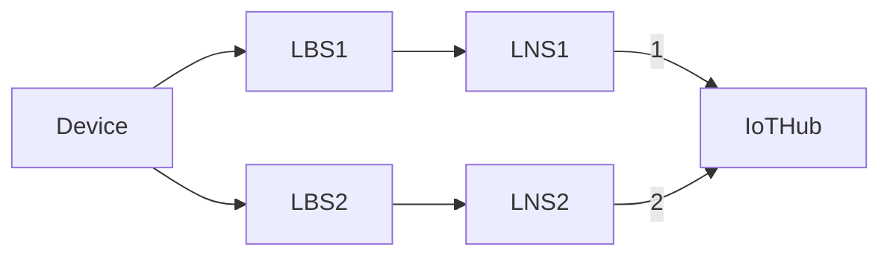
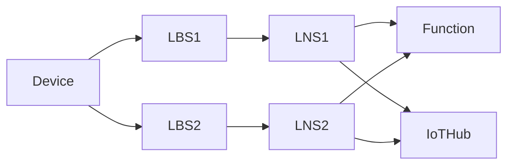

# 009. LNS sticky affinity over multiple sessions

**Feature**: [#1475](https://github.com/Azure/iotedge-lorawan-starterkit/issues/1475)  

**Authors**:

**Status**: Proposed
__________

## Problem statement

Consider the scenario:

where LNS 1 and 2 make use of their IoT Edge Hub modules to connect to IoT Hub.

IoT Hub limits active connections that an IoT device can have to one. Imagining that connection 1 is
already open and a message from LNS2 arrives, IoT Hub will close connection 1 and open connection 2.
Edge Hub on LNS1, will detect this and assume it's a transient network issue, therefore will try
proactively to reconnect to IoT Hub. IoT Hub will now drop the connection 2 to re-establish the
original connection 1.  

This connection "ping-pong" will continue happening, negatively impacting the scalability due to the
high costs of setting up/disposing the connections. From our load tests we observed that in this
scenario we were not even able to connect more than 120 devices to two LNSs, while in a single LNS
topology we could scale up to 900 devices without issues.

## Out of scope

- Deduplication strategies Mark and None: these strategies rely on multiple LNSs sending message.
Potentially we could consider other work arounds for the IoT Hub limitation of a single connection
per device but we find it acceptable for the Mark and None strategies to not be as scalable as the
Drop strategy and will only document this limitation for potential users to be aware of.

- LNS performs operations on behalf of a device/sensor and a concentrator/station. However since a
concentrator can be connected to at most one LNS, there is no ping-pong happening with operations on
stations.

## Limitations

- We should avoid introducing additional calls to the Function as this would also hurt scalability.
  
## In-scope

- The problem can be manifested whenever we do operations against Iot Hub on behalf of edge devices.
  These can be:
  - Twin reads
  - Twin writes (updates/deletes)
  - D2C messages
  - C2D messages
- Roaming edge devices (that potentially lose connectivity to an LNS) are in scope.

### Problematic connections opened on behalf of edge devices

- Data message flows
  - Join: 
  - Data: MessageDispatcher.DispatchLoraDataMessage gets the twin (if LoRaDevice not in cache)
    - Direct method for Class C should return an error if it could not send
      message downlink so that the user can retry.

Version, LNS discovery and CUPS update endpoints are not affected.

### Background tasks

- LoRaDeviceCache refresh in the background: every 10 minutes we are checking for devices that need
  refreshing (those that were not refreshed in the last 2 days). Refreshing a device gets the twin
  of the device ❔
  - if we are the losing LNS we adjust LastSean property but not refresh the entry
  - in order to not have stale entries we could refresh the twin once we become the winning LNS from
    the data (also required for join?) flow  

Alternative:
SearchByDevAddr: the function returns info about the winning gateway
Requires doing the Mic computation on the Function

## Possible solutions

### Delayed processing of messages from losing LNSs

The main idea here is to delay the processing of future messages for all gateways *besides* the
winning one. This should give enough time to the chosen LNS to process the message and keep the
active connection to Iot Hub. The winning gateway is decided by the Function.

#### Example scenario in main data message flow

Assuming the topology:

where Device sends data message A and then B.

Here is a rundown of what should happen marked in **bold**:

- Device sends first data message A.
- We assume that LNS1 gets the message first. **LNS1 checks against
  an in-memory dictionary DevEui -> flag** and since it has not seen this DevEui before (flag is
  false) contacts the FunctionBundler.
- The Function hasn't seen this DevEui either and therefore does not have an assigned LNS for it
  yet. LNS1 wins the race and gets immediately a response and processes the message upstream.
- LNS2 eventually receives message A, **checks its local dictionary** and also contacts the FunctionBundler since it does not have prior info about this DevEui.
- The Function responds to LNS2 that it lost the race to process this message.
- Since deduplication strategy is Drop, LNS2 drops the message immediately, therefore no
  connection to Iot Hub is opened and only LNS1 has the connection to Iot Hub. **LNS2 also notes in
  memory that it was the losing gateway for this DevEui**.
- When message B gets send (with a higher frame counter), assuming that this time LNS2 gets it
  first it **checks again its local dictionary it's not the preferred LNS for this device and
  therefore delays itself X ms before contacting the FunctionBundler**.
- This delay gives LNS1 a time advantage to reach the FunctionBundler first and win the race again, failing
  back to the previous case of message A. The active connection stays with LNS1.
  - If this delay is not sufficient for LNS1 to win the race, LNS2 will contact the FunctionBundler which
    now awards LNS2 as the "winning" LNS. LNS2 will process message upstream (therefore the active
    connection will switch to it) and **removes the "losing flag" from the in-memory store**.
  - **The Function also proactively informs LNS1** that is not anymore the winning LNS for this
    device. The reason why we do this proactively is that otherwise its Edge Hub will try to
    reconnect to IoT Hub even if there is no more messages picked up from LNS1 (out of range roaming
    client). Additionally, **LNS1 would not need to refresh its LoRaDeviceCache anymore for this
    device**.
    - Direct method and should be retried (e.g. in memory retries or durable Function): direct
      method could fail due to the module being or Edge Hub being down, other connectivity issue
      etc. Is in memory retries sufficient here? ❔
  - If LNS1 in the meantime gets message B and contacts the FunctionBundler, it will let it know
    that it lost the race for this frame counter and must therefore drop the message, **mark
    itself as the losing LNS and close the connection**.

#### Handling of Join requests

Join requests in isolation currently do not have the connection stealing issue, as they rely on the Function for
the DevNonce check. If the current LNS is not the preferred gateway, it drops the message
immediately.

We could also consider storing the information that we were the losing LNS locally on the LNS. The
advantages of that are:

- subsequent Data (or Join) requests do not potentially switch the connection
- same handling as in the Data flow (therefore easier to follow)
  
Not sure the following section is relevant as both data and join flow need DevEui.
The problem is that the Data message flow relies on the DevAddr while here we only have the DevEui.
Ways to solve this:

- Split the creation of the LoRaDevice from fetching the twin, create a dummy LoRaDevice and
  mark our LNS as the losing one.
- Store outside of LoRaDevice a data-structure with DevEui: flag (winning or losing) and inject
  also on the data message handler
- Do nothing and accept that a one-off connection stealing on the first data message can happen.

#### Delay on the LNS itself or on the Function ❔

What are the scenarios that it's better that the function implements the delay?

Disadvantages of using a Task.Delay on the Function:

- Observability: potentially we are messing up the measurements of the Function duration.
- Keeps the HTTP connection between the LNS-Function open for more time.
  
#### Device reset ❔

What happens if we have a device reset between message A and B? We save the twin
immediately (irrelevant but how does the Function get it for the deduplication decision?)

Unclear what is the relationship between the twin and the cache on the function: in the cache we
keep the framecounter down from the twin but not the fcnt up ❔

- If both LNSs receive message B, LNS1 SHOULD reset the frame counter. LNS2 then
call the Function first to reset the frame counter/clear the cache.
  - The Function will update the device twin frame counter to 0 (it needs a DeviceClient that would
    cause a temporary connection switch - to be investigated if this is a problem)
  - Clear cache entry or update the entry with both frame counter down and up to 0.
  - Returns the result to the LNS: whether it was the winning or losing one
  - LNS reacts as described before

Alternative would be to switch the order of the operations: first clear the cache and then (if we
are the winning LNS) update the twin.

#### Feature flag

Unclear what is the exact use-case here ❔ We could still set the delay to 0.

The stickiness feature can be disabled with a feature flag on the LNS configuration.

- By default LNS implements sticky affinity. When the flag is set, LNS allow the connection
  ping-pong to happen.
- This flag is only checked if we are on the Drop deduplication strategy (as Mark and None do not
  support stickiness anyway)

#### Consequences / implementation

- In memory storage is DevEui -> boolean.
- Where to store locally on LNS❔ Can be on the

  - LNS LoRaDeviceClient.ConnectionManager since all of the operations pass through it.
  - LoRaDevice
  - LoRaDeviceClient

### Single point of connection handling on LoRaDevice

TODO Atif's changes.

## Other candidates considered

### Using direct mode (not Edge hub)

Less problematic than using Edge Hub but still has temporary connection stealing and can not be done
due to the offline capabilities that the Edge Hub offers us.

The [IoT Edge hub
module](https://docs.microsoft.com/en-us/azure/iot-edge/iot-edge-runtime?view=iotedge-2020-11#iot-edge-hub)
is responsible for communication, acting as a man-in-the-middle to IoT Hub. One of the major
features it offers is [offline
support](https://docs.microsoft.com/en-us/azure/iot-edge/offline-capabilities?view=iotedge-2020-11#how-it-works)
that ensures messages are not lost and communication can still happen between child devices even
when connectivity to Iot Hub is lost. When connectivity resumes it ensures the communication
continues normally.

### Parent-child gateways

On deployments where multiple gateway servers are used, they need to have a parent 

Child LNS A ____ | Parent Gateway using AMQP maintains a single connection to IoTHub | Child LNS B
                ____|

Not possible due to single parent limitation (not supporting roaming LNSs)

## Questions

❔ Should we investigate if creating a DeviceClient already steals the connection or we know this
doesn't happen?

❔ The winning LNS could still crash after winning the race but this was already the case and is
handled with resubmissions.

❔ 300/400ms? configurable
