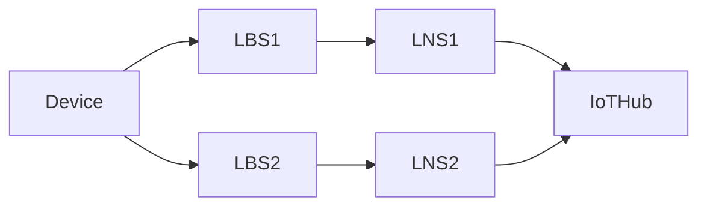
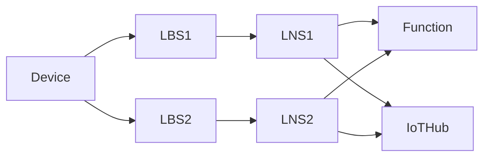

# 009. LNS sticky affinity over multiple sessions

**Feature**: [#1475](https://github.com/Azure/iotedge-lorawan-starterkit/issues/1475)  

**Authors**:

**Status**: Proposed
__________

## Problem statement

Consider the scenario:

where LNSs make use of the IoT Edge Hub module to connect to IoTHub.

IoTHub limits active connections that an IoT device can have to it to one. When multiple messages
from the same device reach IoTHub from different network servers (LNS) as above, IoTHub closes the
existing connection it has. Edge Hub on the dropped LNS side, detects this and assumes it's a
transient network issue, therefore tries proactively to reconnect to IoTHub. Now IoTHub drops again
the previous connection to re-establish the original connection. This connection "ping-pong" is
negatively impacting the scalability due to the high costs of setting up/disposing the connections.
From our load tests we observed that in this scenario we were not even able to connect 500 devices
to the same concentrator when in a single LNS topology we could scale up to 900 devices without
issues.

## In-scope

The problem can be manifested whenever we do operations against Iot Hub. These can be:

- Twin read
- Twin write (update/delete etc)
- D2C join/data message
- C2D join-accept/confirmation

## Out of scope

- Deduplication strategies Mark and None: these strategies rely on multiple LNSs sending the same
  messages which by definition can not operate in highly connected scenarios. We will only document
  this limitation for potential customers to be aware of.

- Class C devices are not facing this issue for C2D messages as they are using the module client​:
  todo verify this claim ❔

## Possible solutions

We need to make sure that only a single LNS has an active connection to IoT Hub at a given time.
Here are a few ways to achieve this:

### Delayed processing of messages from losing LNSs

The main idea here is to delay the processing of future messages for all gateways *besides* the
winning one. This should give enough time to that chosen LNS to process the message and keep the
active connection to Iot Hub. The Function is already the single point where data messages get
deduplicated before being sent upstream. What is changing here is the way we react to the response
from the Function.

#### Example scenario in main data message flow

Assuming the topology:

where Device sends data message A and then B.

Here is a rundown of what should happen, with changes indicated with ⭕

- Device sends first data message A.
- Assuming that LNS1 gets the message first and since it hasn't seen this DevEui before, it contacts
  the Function.
- The Function hasn't seen this DevEui either and therefore does not have an assigned LNS for it
  yet. LNS1 wins the race and gets immediately a response and processes the message upstream.
- LNS2 eventually receives message A and also contacts the Function since it does not have prior
  info about this devEui.
- The function responds to LNS2 that it lost the race to process this message.
- ⭕ Since deduplication strategy is Drop, LNS2 drops the message immediately, therefore no
  connection to Iot Hub is opened and only LNS1 has the connection to Iot Hub. It also notes in
  memory that it was the losing gateway for this DevEui.
- ⭕ When message B gets send (with a higher frame counter), assuming that this time LNS2 gets it
  first it sees that it's not the preferred LNS for this device and therefore delays itself X ms.
- This delay gives LNS1 a time advantage to reach the Function first and win the race again, failing
  back to the previous case of message A. The active connection stays with LNS1 in this case.
  - If this delay is not sufficient for LNS1 to win the race (because LNS1 crashed or is out of
    range etc), LNS2 will contact the Function which now award LNS2 as the "winning" LNS. LNS2 will
    process message upstream (therefore the active connection will switch to it) and will remove the
    "losing flag" from the in-memory store.
  - When/if LNS1 gets message B and contacts the Function, it will let it know that it lost the race
    for this frame counter and must therefore drop the message and mark itself as the losing LNS, as
    LNS2 did for message A.
  
Another variant here is that all LNSs contact the function immediately and the function delays
sending the response to the losing LNSs.

Open questions: how to handle the case of a device reset between message A and B? We save the twin
immediately (irrelevant but how does the Function get it for the deduplication decision?)

#### Consequences / implementation

- We should store additional state on the LNS itself or the function about which one is the winning
  LNS. 
- We should ensure that deduplication happens as soon as possible and LNSs act on the result before
  any other operations on the twins or D2C/C2D messages are sent.
- Join requests that also make use of the Function to check for the DevNonce should reject faster.

The Network Server:

- During startup we check the certificate thumbprints (twin read) in case of HTTPS. ❔ is this
  enabled in the code now? ⭕ can we contact the function at this stage?
- Once the server is up, there are 3 endpoints
  - Discovery: no twin reading/writing or C2D/D2C message ✔
  - Data message which can be one of
    - version - we perform a twin write for the version then a twin read for the station ⭕ we need
      to contact the Function before writing the twin?
    - join - twin read (for the region) before contacting the Function to check the DevNonce ⭕ we
      should check there the winning LNS. After the Function call we update the twin
      UpdateAfterJoinAsync and send a downstream join accept.
    - data - reads twin (for the region), BeginDeviceClientConnectionActivity, if device resets we
      update the twin, then calls the bundler.
  - CUPS updateInfo: reads twin, then calls the function RunFetchConcentratorFirmware then writes
    back to device

❔ LoraDeviceCache is a singleton where is the refresh happening?!

Where shall we store the info that we are the losing one? Can be on the
LoRaDeviceClient.ConnectionManager since all of  the operations pass through it.

### Using direct mode (not Edge hub)

The [IoT Edge hub
module](https://docs.microsoft.com/en-us/azure/iot-edge/iot-edge-runtime?view=iotedge-2020-11#iot-edge-hub)
is responsible for communication, acting as a man-in-the-middle to IoT Hub. One of the major
features it offers is [offline
support](https://docs.microsoft.com/en-us/azure/iot-edge/offline-capabilities?view=iotedge-2020-11#how-it-works)
that ensures messages are not lost and communication can still happen between child devices even
when connectivity to Iot Hub is lost. When connectivity resumes it ensures the communication
continues normally.

In scenarios where scalability is a priority and dropped messages are acceptable, it could be
evaluated to not pass messages through Edge hub but instead use direct mode to connect to Iot Hub.

### Single threaded access to single message queue

TODO

## Other candidates

### Parent-child gateways 

On deployments where multiple gateway servers are used, they need to have a parent 

Child LNS A ____ | Parent Gateway using AMQP maintains a single connection to IoTHub | Child LNS B
                ____|

Not possible due to single parent limitation (not supporting roaming LNSs)

## Questions

- The ping pong occurs only when we are going through the local Edge Hub module? why is that? Edge
  hub tries to reconnect for us to keep the cache fresh.
