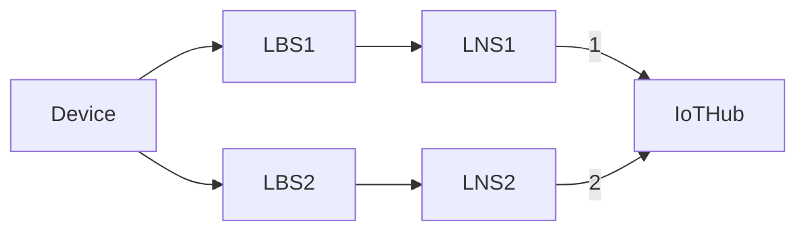
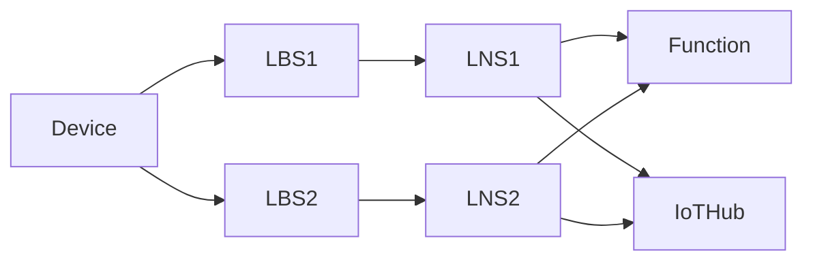

# 009. LNS sticky affinity over multiple sessions

**Feature**: [#1475](https://github.com/Azure/iotedge-lorawan-starterkit/issues/1475)  

**Authors**:

**Status**: Proposed
__________

## Problem statement

Consider the topology:

where LNS 1 and 2 make use of their IoT Edge Hub modules to connect to IoT Hub.

IoT Hub limits active connections that an IoT device can have to one. Assuming that connection 1 is
already open and a message from LNS2 arrives, IoT Hub will close connection 1 and open connection 2.
Edge Hub on LNS1, will detect this and assume it's a transient network issue, therefore will try
proactively to reconnect to IoT Hub. IoT Hub will now drop the connection 2 to re-establish the
original connection 1.  

This connection "ping-pong" will continue happening, negatively impacting the scalability due to the
high costs of setting up/disposing the connections. From our load tests we observed that in this
scenario we were not even able to connect more than 120 devices to two LNSs, while in a single LNS
topology we could scale up to 900 devices without issues.

## Out of scope

- Deduplication strategies Mark and None: these strategies rely on multiple LNSs sending message.
Potentially we could consider other work arounds for the IoT Hub limitation of a single connection
per device but we find it acceptable for the Mark and None strategies to not be as scalable as the
Drop strategy and will only document this limitation for potential users to be aware of.

- LNS performs operations on behalf of a device/sensor and a concentrator/station. However since a
concentrator can be connected to at most one LNS, there is no ping-pong happening with operations on
stations.
  
## In-scope

- The problem can be manifested whenever we do operations against Iot Hub on behalf of edge devices.
  These can be:
  - Twin reads
  - Twin writes (updates/deletes)
  - D2C messages
  - C2D messages
- Roaming leaf devices (that potentially become out-of-range from an LNS) are in scope.

### Problematic IoT Hub operations on behalf of edge devices

- Background tasks
  - Periodically we refresh the LoRaDeviceCache, which results in device twin reads that could
    switch the connection -> see [handling of background tasks section](#handling-of-background-tasks)
- Message flows
  - Join -> see [handling of Join requests section](#Handling-of-Join-requests)
  - Data:
    - if the device is not in LoRaDeviceCache, we fetch the device twin -> see [LoRaDevice not in cache section](#data-flow-loradevice-not-in-loradevicecache)
    - if a frame counter reset happened, we update the twin immediately -> see [handling of resets section](#handling-of-device-resets)
    - in the main data flow we send upstream, downstream and write the new twin -> see [main data flow section](#main-data-message-flow)
    - Class C direct downstream messages sent from the portal could result in a connection switch if
    it targets a LNS other than the last connected one but we consider this as out of scope.

Version, LNS discovery and CUPS update endpoints are not affected by this issue.

## Possible solution

The main idea is to give the current connection holder as indicated from the Function, the edge to
continue processing messages for this device. That gateway, will have 0 impact on performance.

### Handling of cache refresh

When we create the (singleton) instance of the NetworkServer.LoRaDeviceCache, we start a background periodical
task to ensure the device twins for all the devices that connected to that LNS are kept fresh. In
the case where we need to get a device twin, this could trigger a connection
ping-pong.

Ideally we would need to refresh the cache only if, after reaching out to the function,
the LNS is marked as the "winning" one for device "XYZ".

It is marked as the "losing" gateway, we could adjust the LastSeen property but not actually refresh the entry in the cache.

When the next data message for "XYZ" comes in and an entry is in cache for such device, in the event that
the Azure Function is marking our LNS as the new "winning" gateway, we have a stale twin in the
cache that needs to be updated before processing.

Alternatives considered, but which are deemed not viable

- Remove device entry from the cache when we are the losing gateway: if we were to do this, a "get
  twin" operation would be triggered as soon as the next data message is coming in from the device in question.
- Do nothing and accept there will be a potential connection switching periodically (currently every
  2 days)
- Remove the background refresh feature all-together.

### Handling of Join requests

Join requests in isolation currently do not have the connection stealing issue, as they already rely on the
Function for the DevNonce check. If the current LNS is not the preferred gateway, it drops the
message immediately.

❔ We could also consider storing the information that we were the losing LNS locally on the LNS and
handle "backoff" in the same way as in the Data flow. The advantages of doing that are:

- subsequent first Data (or future Join) requests do not switch the connection
- same handling as in the Data flow (therefore easier to understand)

Alternative is to do nothing and accept that a one-off connection stealing on the first Data message can happen.

### Data flow: LoRaDevice not in LoRaDeviceCache

Currently, if LoRaDevice is not in the cache we search on the Function for all devices that have
that DevAddr. Then we get their twins which could result in a connection switch.

We should instead ❔

- Amend DeviceGetter.GetDevice so that it returns info about whether we are the winning gateway
  - if we are, it is safe to load the twin (we already have the connection)
  - if we are not the winning LNS, we should not load the twin drop the message and mark ourselves as the losing gateway
    - next time we get a message from that device we should artificially delay ourselves and check again on the Function.
      - if this time we are the winning LNS we load the twin.
      - if not we drop the message again.
  - This would require moving the Mic computation on the Function (?) 

### Handling of ABP relax frame counter reset

When we detect a device reset after a message, we currently save the twin immediately and then clear
the Function cache. This twin write could result in a connection ping-pong.

We should instead:

- Clear the cache in the Function as we do currently.
- The Function is changed to return if we are the losing LNS. If we are the losing one, we drop the message here,
  mark ourselves as the losing gateway etc.
- Otherwise we process message normally and at the end update the twin as we currently do.

Alternative considered but discarded because of a possible connection switch: use the Function to do
both operations

- update the device twin frame counter to 0 (as frame counter is a reported property it needs to be
  changed via a DeviceClient that could cause a connection switch)
- Clear or update the cache entry with frame counter down and up to 0.
- Returns the result to the LNS: whether it was the winning or losing one
- LNS reacts as described in the [main data flow section](#main-data-message-flow)

### Main data message flow

Assuming the topology:

where Device sends data message A and then B.

Here is a rundown of what should happen marked in **bold**:

1. Device sends first data message A.
1. We assume that LNS1 gets the message first. **LNS1 checks against
   an in-memory dictionary DevEui -> flag** and since it has not seen this DevEui before (flag is
   false) contacts the GetDevice.
1. The Function hasn't seen this DevEui either and therefore does not have an assigned LNS for it
  yet. LNS1 wins the race and gets immediately a response and processes the message upstream.
1. LNS2 eventually receives message A, **checks its local dictionary** and also contacts the FunctionBundler since it does not have prior info about this DevEui.
1. The Function responds to LNS2 that it lost the race to process this message.
1. Since deduplication strategy is Drop, LNS2 drops the message immediately, therefore no
   connection to Iot Hub is opened and only LNS1 has the connection to Iot Hub. **LNS2 also notes in
   memory that it was the losing gateway for this DevEui**.
1. When message B gets send (with a higher frame counter), assuming that this time LNS2 gets it
   first it **checks again its local dictionary it's not the preferred LNS for this device and
   therefore delays itself X ms before contacting the FunctionBundler**.
   - Here we can *not* simply drop as LNS1 might not be available anymore (due to a crash, device not
     in range etc).
1. This delay gives LNS1 a time advantage to reach the FunctionBundler first and win the race again, failing
    back to the previous case of message A. The active connection stays with LNS1.
1. If this delay is not sufficient for LNS1 to win the race, LNS2 will contact the FunctionBundler which
   now awards LNS2 as the "winning" LNS. LNS2 **needs to first get the device twin** as it might have a
   stale version and then can process message upstream. It also **removes the "losing flag" from its in-memory store**.
2. **The Function also proactively informs LNS1** that it's not anymore the winning LNS for this
   device. The reason why we do this proactively is that otherwise its Edge Hub will try to
   reconnect to IoT Hub even if there is no more messages picked up from LNS1 (out of range roaming
   client). Additionally, **LNS1 would not need to refresh its LoRaDeviceCache anymore for this
   device** (see [previous section about caching](#data-flow-loradevice-not-in-loradevicecache)).
3. Direct method and should be retried (e.g. in memory retries or durable Function): direct
   method could fail due to the module being or Edge Hub being down, other connectivity issue
   etc. Is in memory retries sufficient here? ❔
4. If LNS1 in the meantime gets message B and contacts the FunctionBundler, it will let it know
   that it lost the race for this frame counter and must therefore drop the message, **mark
   itself as the losing LNS and close the connection**.

NB: the FunctionBundler is not called in certain topologies e.g. when multiple LBSs are connected to
the same LNS but these topologies are not relevant for the issue here).

#### Handling Class C devices downstream direct messages

When we send a downstream message using Direct method via the Function, the Function is responsible
for choosing the prererred gateway based on its existing knowledge of the preferred gateway. Due to
that we can be sure that we have the active connection and can therefore send downstream messages.

#### Implementation

The LNS in-memory dictionary is mapping DevEuis to a flag indicating whether we are the winning or losing LNS.

- Where should we store locally this structure ❔

  - LNS LoRaDeviceClient.ConnectionManager since all of the operations pass through it.
  - LoRaDevice: in the case of Join requests we don't yet have a LoRaDevice and would need to create
    one without fetching the twin
  - LoRaDeviceClient

#### Delay on the LNS itself or on the Function ❔

What are the scenarios that it's better that the function implements the delay?

Disadvantages of using a Task.Delay on the Function:

- Observability: potentially we are messing up the measurements of the Function duration.
- Keeps the HTTP connection between the LNS-Function open for more time.
  
#### Delay amount configuration

The delay amount should be configurable to allow users to customize behavior for their scenarios.
During load testing we tested with 400ms but smaller values should be tried as well. If 0ms are
specified the stickiness feature is disabled which means potential connection switching.

## Other candidates considered

### Single point of connection handling on LoRaDevice

The changes presented from Atif: would also ensure by design that new code does not open more
connections to IoT Hub accidentally.

No matter where we are doing the check on the LNS side (single point as in Atif's ADR or existing
code with multiple entry points) the changes on the Function side are still required.  

### Using direct mode (not Edge hub)

Using direct mode is less problematic in terms of connection stealing but still had the issue. The
idea was dropped because then we would miss the [offline
capabilities](https://docs.microsoft.com/en-us/azure/iot-edge/offline-capabilities?view=iotedge-2020-11#how-it-works)
that Edge Hub offers us.

### Parent-child gateways

We could utilize child-parent connections and parent multiple LNS under a single [transparent
gateway](https://docs.microsoft.com/en-us/azure/iot-edge/how-to-create-transparent-gateway?view=iotedge-2020-11)
that has the active connection to IoT Hub. The problem there is that children can have only 1 parent
and therefore we can not support roaming leaf devices that connect to different LNSs over time.
