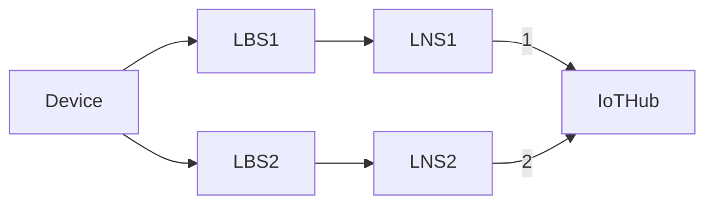
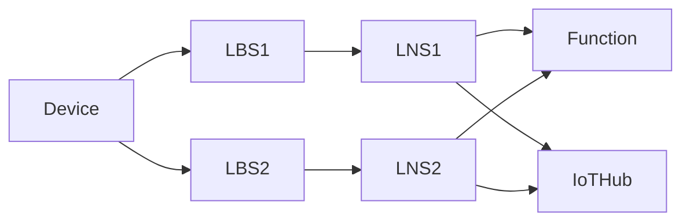

# 009. LNS sticky affinity over multiple sessions

**Feature**: [#1475](https://github.com/Azure/iotedge-lorawan-starterkit/issues/1475)  

**Authors**:

**Status**: Proposed
__________

## Problem statement

Consider the scenario:

where LNS 1 and 2 make use of their IoT Edge Hub modules to connect to IoT Hub.

IoT Hub limits active connections that an IoT device can have to one. Imagining that connection 1 is
already open and a message from LNS2 arrives, IoT Hub will close connection 1 and open connection 2.
Edge Hub on LNS1, will detect this and assume it's a transient network issue, therefore will try
proactively to reconnect to IoT Hub. IoT Hub will now drop the connection 2 to re-establish the
original connection 1.  

This connection "ping-pong" will continue happening, negatively impacting the scalability due to the
high costs of setting up/disposing the connections. From our load tests we observed that in this
scenario we were not even able to connect more than 120 devices to two LNSs, while in a single LNS
topology we could scale up to 900 devices without issues.

## Out of scope

- Deduplication strategies Mark and None: these strategies rely on multiple LNSs sending message.
Potentially we could work around the IoT Hub limitation of a single connection per device by
opening and closing connections but we find it acceptable for the Mark and None strategies to not be as scalable as
the Drop strategy and will only document this limitation for potential users to be aware of.

- LNS performs operations on behalf of a device/sensor or a concentrator/station. However since a
concentrator can be connected to at most one LNS, there is no ping-pong happening with operations on
stations.

## Limitations

- We should avoid introducing additional calls to the Function as this would also hurt scalability.
  
## In-scope

- The problem can be manifested whenever we do operations against Iot Hub on behalf of edge devices. These can be:
  - Twin reads
  - Twin writes (updates/deletes)
  - D2C messages
  - C2D messages
- Roaming edge devices (that potentially lose connectivity to an LNS) are in scope.

### Connections opened on behalf of edge devices

- Data message endpoints:
  - join: the DeviceGetter.GetDevice Function is used to detect and drop duplicates
  - data: BeginDeviceClientConnectionActivity already creates a deviceclient
- Device creation LoraDeviceFactory.CreateAndRegisterAsync
  - if LoRaDevice is not in Cache, creates a DeviceClient. Happens in
    MessageDispatcher.DispatchLoraDataMessage that is called before the message flows above
  - class C send downstream (why is that not a problem? can it not get the connection of an upstream
    message)❔

Version, LNS discovery and CUPS update endpoints are not affected.

### Background tasks

- LoRaDeviceCache refresh in the background: every 10 minutes we are checking for devices that need
  refreshing (those that were not refreshed in the last 2 days). Refreshing a device calls
  BeginDeviceClientConnectionActivity that opens a connection

## Possible solutions

### Delayed processing of messages from losing LNSs

The main idea here is to delay the processing of future messages for all gateways *besides* the
winning one. This should give enough time to that chosen LNS to process the message and keep the
active connection to Iot Hub. The Function is already the single point where data messages get
deduplicated before being sent upstream.

#### Example scenario in main data message flow

Assuming the topology:

where Device sends data message A and then B.

Here is a rundown of what SHOULD happen:

- Device sends first data message A.
- Assuming that LNS1 gets the message first and since it hasn't seen this DevEui before, it contacts
  the Function.
- The Function hasn't seen this DevEui either and therefore does not have an assigned LNS for it
  yet. LNS1 wins the race and gets immediately a response and processes the message upstream.
- LNS2 eventually receives message A and also contacts the Function since it does not have prior
  info about this devEui.
- The function responds to LNS2 that it lost the race to process this message and stores the winning LNS.
- Since deduplication strategy is Drop, LNS2 drops the message immediately, therefore no
  connection to Iot Hub is opened and only LNS1 has the connection to Iot Hub. LNS2 SHOULD also note in
  memory that it was the losing gateway for this DevEui.
- When message B gets send (with a higher frame counter), assuming that this time LNS2 gets it
  first it SHOULD see that it's not the preferred LNS for this device and therefore delays itself X ms.
- This delay gives LNS1 a time advantage to reach the Function first and win the race again, failing
  back to the previous case of message A. The active connection stays with LNS1 in this case.
  - If this delay is not sufficient for LNS1 to win the race, LNS2 will contact the Function which
    now award LNS2 as the "winning" LNS. LNS2 will process message upstream (therefore the active
    connection will switch to it) and SHOULD remove the "losing flag" from the in-memory store.
  - The Function SHOULD also proactively inform LNS1 that is not anymore the winning LNS for this
    device. If not, its Edge Hub will try to reconnect to IoT Hub even if there is no more messages
    picked up from LNS1 (out of range roaming client). 
  - If LNS1 in the meantime gets message B and contacts the Function, it will let it know that it lost the race
    for this frame counter and must therefore drop the message and SHOULD mark itself as the losing LNS, as
    LNS2 did for message A.

What are the scenarios that it's better that the function implements the delay? 
Do we need the delay in both the LNS and the function?
  
Open questions: how to handle the case of a device reset between message A and B? We save the twin
immediately (irrelevant but how does the Function get it for the deduplication decision?)

#### Feature flag

The stickiness feature can be disabled with a feature flag on the LNS configuration.

- By default LNS implements sticky affinity. When the flag is set, LNS allow the connection
  ping-pong to happen.
- This flag is only checked if we are on the Drop deduplication strategy (as Mark and None do not
  support stickiness anyway)

#### Consequences / implementation

- Join request flow needs to be adjusted as well
- Cache refresh uses EnsureConnected method that should be changed (removed?)
- How to fix at the messageDispatcher level ❔ Can we already call the function there?
- ❔ Where shall we store the info that we are the losing one? Can be on the:
  - LNS LoRaDeviceClient.ConnectionManager since all of the operations pass through it.
  - On the Function

### Using direct mode (not Edge hub)

The [IoT Edge hub
module](https://docs.microsoft.com/en-us/azure/iot-edge/iot-edge-runtime?view=iotedge-2020-11#iot-edge-hub)
is responsible for communication, acting as a man-in-the-middle to IoT Hub. One of the major
features it offers is [offline
support](https://docs.microsoft.com/en-us/azure/iot-edge/offline-capabilities?view=iotedge-2020-11#how-it-works)
that ensures messages are not lost and communication can still happen between child devices even
when connectivity to Iot Hub is lost. When connectivity resumes it ensures the communication
continues normally.

In scenarios where scalability is a priority and dropped messages are acceptable, it could be
evaluated to not pass messages through Edge hub but instead use direct mode to connect to Iot Hub.

### Single threaded access to single message queue

TODO

## Other candidates

### Parent-child gateways

On deployments where multiple gateway servers are used, they need to have a parent 

Child LNS A ____ | Parent Gateway using AMQP maintains a single connection to IoTHub | Child LNS B
                ____|

Not possible due to single parent limitation (not supporting roaming LNSs)

## Questions

❔ If we keep the info on the Function why also local?

❔ why class c are safe from the problem?

❔ Can we assume that if we lose the race on the first problematic operation against IoT Hub we
should abandon all further operations?  

Yes, assuming we choose the right threshold.
