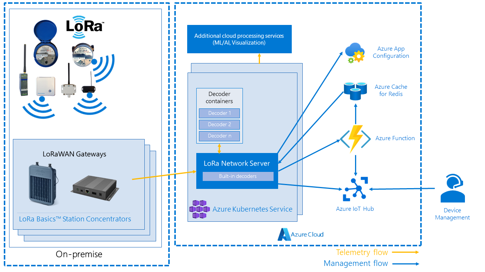

# 012. Decouple LoRaWAN Network Server from IoT Edge

**Feature**: [#1553](https://github.com/Azure/iotedge-lorawan-starterkit/issues/1553)  
**Authors**: Daniele Antonio Maggio  
**Status**: Proposed  

__________

## Problem statement

As of v2.1.0, the LoRaWAN Starter Kit makes use of Azure IoT Edge in order to host and manage LoRaWAN Network Server (LNS).  
When it comes to LNS, IoT Edge based deployments allow interesting features such as:

- centralized deployment through IoT Hub
- store and forward processing of leaf-device messages that need to be routed upstream
- management of configuration through [module twins](https://docs.microsoft.com/en-us/azure/iot-hub/iot-hub-devguide-module-twins) and desired property updates
- ability to "[invoke direct methods from IoT Hub](https://docs.microsoft.com/en-us/azure/iot-hub/iot-hub-devguide-direct-methods)"
- on prem data processing

With v2.0.0, the LoRaWAN Starter Kit moved from [Packet Forwarder](https://github.com/Lora-net/packet_forwarder) to a more reliable (WebSockets/TCP) and secure (mTLS capable) [Basics Station](https://github.com/lorabasics/basicstation).

This change opens up to deployment models where the LNS is hosted on a different machine from the on-premises concentrator device which is forwarding the LoRa packets.

As an example, LNS could still be hosted on-premises in a separate dedicated IoT Edge device. When it comes to scalability or high-availability, it's not always easy to provision additional IoT Edge based devices and, maybe, you could have some existing infrastructure that you might want to re-use (i.e. a Kubernetes cluster).

In addition, if you want to use Azure for hosting and scaling the LoRaWAN Network Server, in order to handle messages from different sites/locations, IoT Edge is not the proper technology to put into the cloud.

This ADR will focus on the needed changes that will allow to deploy a LoRaWAN Network Server without a strict dependency on Azure IoT Edge, while preserving functionalities like centralized configuration management and remote invocation of methods in LNS.

### In-scope

- Describe how to differentiate "edge" LNSs deployments from "cloud" ones in mixed scenarios
- Provide an alternative for deploying and managing configuration
- Provide additional information on abstracting and replacing ModuleClient related dependencies, such as:
  - Direct methods (currently used for Clearing Cache, forcefully closing DeviceClient connections, handling class-c c2d messages)
  - Twin updates (currently used for updating few configuration items, without restarting the entire LNS)
- Provide information on a "Function" endpoint for clearing cache of all "cloud" LNSs
- Describe a sample deployment scenario being enabled by decoupling

### Out of scope

- Key Vault integration for secrets management  
It would be great to make use of Azure Key Vault to securely store components like Azure Function authentication code or Server Certificate for Secure BasicsStation-LNS communications, but this document will not focus on this aspect.

## Changes required

Before diving in the various required changes, let's understand the "IoT Edge" bindings that are there in the code.

The main difference comes to "ModuleConnectionHost", which is responsible for:

- Instantiating a [ModuleClient](https://docs.microsoft.com/en-us/dotnet/api/microsoft.azure.devices.client.moduleclient?view=azure-dotnet) object to be used for interacting with module twins and receiving direct method invocations
- Setting a callback on "desired property updates" for dynamically configuring some configuration variables
- Setting a callback on "direct method invocation" for handling:
  - Clearing LNS device registry cache
  - Closing DeviceClient connections for avoiding "ping-pong" as described in [ADR 010](./010_lns_affinity.md)
  - Sending Cloud to Device (c2d) messages for Class-C devices

Except for ModuleConnectionHost, the other difference is concerning the ability to "proxy" leaf-device messages through Edge Hub. By default the "ENABLE_GATEWAY" environment variable is set to true, we need to make sure that **ENABLE_GATEWAY can't be set to true when not running as Edge module**.

### Addressing and routing requests to a specific LNS

The biggest concern in this section is regarding how the Azure Function is addressing and routing a specific LNS with the new deployment model.

When running parallel instances of the LNS, it is crucial to identify a very specific instance for properly routing method invocations like cache clear, connection closes and class-c cloud-to-device messages sends.

#### Mutually exclusive deployment modes

The easiest possibility, is to deploy the Azure Function in such a way that it is mutually exclusive whether to target "Edge" or "Cloud" deployments.

This would require the introduction of an environment variable, i.e. "TARGET_CLOUD_LNS", which would allow to inject different implementations of the IServiceClient interface, currently responsible for both handling direct method invocations and sending c2d messages (both class-a and class-c devices).

The new "cloud only" implementation, would need to make use an alternative for invoking such methods. This is described in ["Direct method invocation"](#direct-method-invocation) section

This alternative is discarded in favor of allowing mixed deployment modes in order to maximize the flexibility of this starter kit.

All the following sections are therefore thought for a "mixed-deployment" scenario where both Edge LNS and Cloud LNS are running at the same time and targeting/being targeted by the same set of Azure Functions.

#### Identifying whether a LNS is running in edge or cloud mode

As of v2.1.0, the LNS code is able to understand whether it is running as IoT Edge Module or not. Currently, the availability of the "IOTEDGE_APIVERSION" environment variable is checked. This variable is injected by the "Edge Agent" component at the moment of module creation and startup, therefore if the variable is not there we can safely assume that the LNS is not running in a Edge environment.

We need to be able to identify in the function, **if a particular LNS is running standalone or deployed on edge**, to be able to address the LNS through different channels (edge->IoT Hub, standalone->topic).

It is therefore decided to **identify if a LNS is running standalone or on edge by using a new "CLOUD_DEPLOYMENT" environment variable (defaults to false)**

While we do not expect "IOTEDGE_APIVERSION" to change in the immediate future and, even if we are adding another environment variable, the decision is taken in order to make the identification more reliable and not depending on IoT Edge.

As an alternative we could still use "IOTEDGE_APIVERSION" and eventually react on future changes.

#### Differentiating LNS instances in mixed-mode deployments

When a leaf device sends a message, its twin gets updated from the LNS with the "GatewayID" variable content, currently being set to the "IOTEDGE_DEVICEID" environment variable (defaulting to an empty string when variable is not set in the environment)

This is the way the "Facade" Azure function has to identify and target a specific LNS instance for closing device client connections or sending C2D messages for class-c devices.

The decision is to:

- Prefix the **"GatewayID" with "cloud-"** for non-Edge deployments
- Use the **"Hostname" environment variable as a default** for GatewayID field

An alternative considered is to identify the difference in deployment model by querying IoT Hub for availability of a "IoT Edge" capable device and cache that result.

An advantage of such alternative is the fact that there's no need to use any prefix for GatewayID which would also not tamper the observability part.

A disadvantage, though, comes from the request quota limits on IoT Hub Device Registry operations which could be cause of throttling and instability for other pieces of the LNS itself.

#### Direct method invocation

As previously mentioned, IoT Edge is allowing the functionality of "direct method invocations" giving the possiblity to remotely invoke some functions on the LNS.

When decoupling LNS from Azure IoT Edge, there are different possibilities for handling the scenarios covered by direct method invocation.

As stated in previous paragraphs, the "Facade" Azure Function has to differentiate between LNS deployment modes depending on the "LNS device id".

This means that an Azure IoT Edge device will still be using the direct method invocations provided by IoT Hub whereas the "cloud" deployments will use a new, different, mechanism.

For "cloud" deployments, such mechanism consists in using Redis Pub/Sub to publish the method invocation events on a topic, to which all the LNS instances are subscribing and filtering based on their "hostname".

The decision is to:

- Reuse [Azure Cache for Redis](https://docs.microsoft.com/en-us/azure/azure-cache-for-redis/cache-overview) instance that it's already being deployed in the solution as it allows the usage of [Redis Pub/Sub functionality](https://redis.io/docs/manual/pubsub/)
- As a stretch goal, useful for high scale and testing scenarios, implement a new function for clearing cache of all the LNS subscribed to the topic

An alternative to "Azure Cache for Redis" for the Pub/Sub functionality is to use "Azure Service Bus". While this would allow higher resiliency, the alternative has been discarded to avoid provisioning another additional service.

One alternative to the Pub/Sub functionality instead, might be to expose REST endpoints on the LNS.

The advantages of this alternative, are definitely the easy implementation and the potential simplification of "manual" invocation of such methods.

At the same time, the disadvantage comes from the fact that, when scaling out, depending on the platform where the replicas of the LNS are hosted, you might have different ways to target exactly one replica; on Kubernetes, for instance, this might be achieved by using a service mesh, but this requires additional configuration

### Managing configuration and its changes

All the configuration is fetched at the start time from the environment variables.

IoT Edge allows you to specify those configuration variables as part of a template for [automatic deployments for single devices or at scale](https://docs.microsoft.com/en-us/azure/iot-edge/module-deployment-monitoring?view=iotedge-2020-11)

Depending on the target cloud service, you might have different ways to manage configuration in a centralized way.

If using Azure Kubernetes Service, a configmap to be applied to the desired cluster might work for you.
If using Azure App Service, you might just set the environment variables in the configuration section of the application.

While these solutions are great for "static" configuration (i.e.: those values that require a restart for being changed), the LNS is coded in such a way that some configuration might be changed dynamically without having to restart the entire network server.

The decision is to **rely on static environment variable configuration, requiring a restart of the module for any configuration change**.

Reasons for this decision are:

- small amount of "dynamic" variables in the system and their nature (i.e. Azure Function URL and Auth changes mean that a system re-deployment is taking place)
- allow to keep the number of deployed Azure services to a minimum, given the "Starter Kit" nature of this repository

As an alternative, especially when it comes to dynamic configuration, it could be possible to make use of "[Azure App Configuration](https://docs.microsoft.com/en-us/azure/azure-app-configuration/overview)".

The service allows to centrally manage application settings and reload any [dynamic configuration using poll model](https://docs.microsoft.com/en-us/azure/azure-app-configuration/enable-dynamic-configuration-aspnet-core?tabs=core5x).

This has been discarded because dynamic configuration is a nice-to-have, not strictly needed for decoupling LNS from Edge, and it requires the deployment and configuration of an additional service.

## Sample "cloud" deployment scenario

The picture above highlights a possible scenario being enabled by decoupling LNS from IoT Edge.

This scenario brings in the possibility of using one (or multiple) Azure Kubernetes Services cluster for running one (or multiple) instances of LoRaWAN Network Server.

While keeping in mind that a LoRa Basics Station can be connected only to a single LNS instance at the same time, with such scenario it could be anyways possible to increase high availability or scalability.

Ideally, the LoRa Basics Station could point to a ["vNext" discovery service](./009_discovery.md) that will be able to balance the load across multiple Azure Kubernetes Service clusters, or in an "active-passive" cluster configuration, only point to the "active" one.

In addition, the load of the potentially multiple LNS instances in the same single cluster could be balanced by routing based on the number of "stations" already connected to the server instances (by leveraging the already existing metric being exported in Prometheus format)

## Summary of the required and proposed changes

- Identify whether LNS is running as IoT Edge Module or not by using a new "CLOUD_DEPLOYMENT" environment variable (defaults to false)
- Check that ENABLE_GATEWAY environment variable is not set to true when not running as Edge module
- Conditionally set the "GatewayID" parameter depending on whether it is running on Edge or not
- Make use of "[Azure App Configuration](https://docs.microsoft.com/en-us/azure/azure-app-configuration/overview)", in "Cloud"  deployment mode, for gathering static and dynamic configuration parameters
- Make use of Redis Pub/Sub functionality, in "Cloud" deployment mode, to handle remote invocation of methods
- In Facade Azure Function, differentiate the mechanism used for remotely invoke methods depending on the "LNS device id"
  - In case of "Cloud" LNS deployment, publish invocation of methods as messages in Redis Pub/Sub
  - Only for "Cloud" LNS deployments, implement a new function for clearing cache of all the LNS subscribed to the topic
