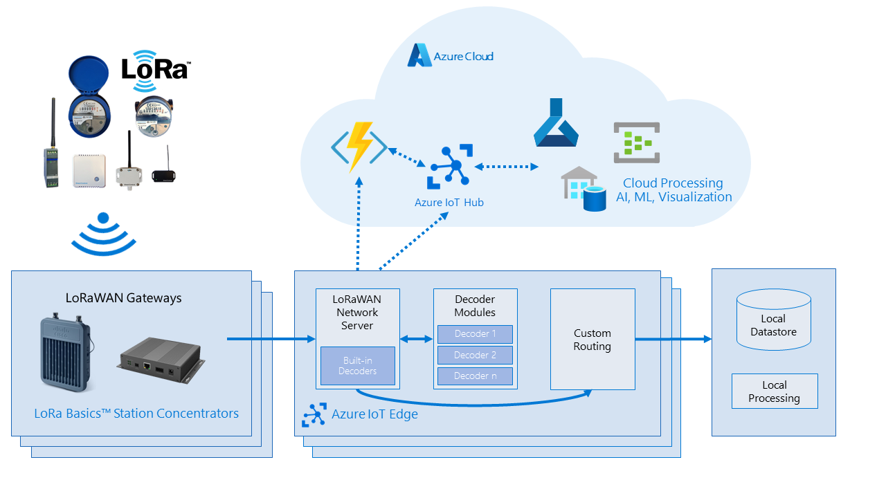

<!-- markdownlint-disable MD025 -->
<!-- markdown-link-check-disable -->
# Azure IoT Edge LoRaWAN Starter Kit

<!-- markdown-link-check-enable -->

!!! info ""

    Built for Low Power Wide Area Network Connectivity to Azure IoT Hub

The LoRaWAN starter kit is an OSS cross platform private network implementation
of the [LoRaWAN specification](https://lora-alliance.org/resource_hub/lorawan-specification-v1-0-2/)
built for connectivity to Azure IoT Hub. It enables users to setup their own
LoRaWAN network that can connect to LoRa based nodes (sensors) and send decoded
message packets to Azure IoT Hub for cloud based processing, analytics and other
workloads.

Alternatively, it allows sending commands from the cloud to the end
nodes. The goal of the the project is to provide guidance and a reference for
Azure IoT Edge users to experiment with LoRaWAN technology.

There is a list of [possible deployment scenarios](user-guide/deployment-scenarios.md)
that outlines some of the scenarios this Starter Kit enables.

## Key Challenges

- Allows LoRa-enabled field gateways to connect directly to Azure without the need for a network operator as intermediary.
- Enables Azure IoT Edge capabilities for the LoRaWAN network, e.g.:
  - Local processing on the Edge gateway
  - Routing to local storage from the Edge gateway
  - Offline capabilities of the gateway
- Homogenous management of devices and concentrators independent of connectivity technology through Azure IoT.
- Off-the-shelf integration with Azure IoT ecosystem, e.g., Azure IoT Hub, Azure Digital Twins, Time Series Insights, etc...

## Features

- LoRaWAN 1.0.2 implementation
(see [LoRaWAN Specification Support](#LoRaWAN-1.0.2-Specification-Support)
for more details)
- Device and Concentrator management done through Azure IoT Hub.
- Bi-directional communication between LoRa end devices and Azure cloud.
- Custom packet decoding framework.
- Identity Translation for LoRa devices with caching support.
- Partial Offline and Casually connected Gateways scenarios.*
- Easy deployment and setup using Azure ARM templates.
- Small to Midsize Scalability Tests.
- Simulator for development and testing without the need to own a Gateway.

## LoRaWAN Specification Support

We plan to support the following key features of LoRaWAN 1.0.2 specification,
however please note that not all of them are available as of today. Please refer
to our release notes for more details on what is available.

- Current supported Specification: *1.0.2*.
- Support of Class A and C devices.
- Support of **EU868**, **US915**, **AS923** and **CN470** channel frequencies.
- Activation through ABP and OTAA.
- Confirmed and unconfirmed upstream messages.
- Confirmed and unconfirmed downstream messages.
- Multi-gateways.
- Multi-concentrators.
- [LoRa Basics™ Station](https://github.com/lorabasics/basicstation) Support
- Message de-duplication.
- Support of MAC commands.
- ADR Support.

## Getting Started

We have a variety of ways you can  get started with the kit, chose the
appropriate documentation based on your persona and applicability.

- **Setup a LoRaWAN Gateway**: We provide an easy to use Azure ARM template and
deployment guidance to get you quickly started with the LoRaWAN starter kit.
Use the [Quick Start](quickstart.md) to setup a LoRaWAN Gateway and
connect to LoRA end nodes.
- **Upgrade an existing installation**:
Refer to the [upgrade guide](user-guide/upgrade.md) for instructions and tips for a
clean upgrade.
- **Develop and debug the LoRaWAN starter kit**: If you are a developer and want
to contribute or customize the LoRaWAN starter kit, refer to our
[Developer Guidance](user-guide/devguide.md) for more details on how to build, test
and deploy the kit in your dev environment. We also support a

- **Enable a gateway or device to be compatible with the starter kit**: We have
developed the LoRaWAN starter kit agnostic of a device manufacturer
implementation and focused on the specifics on underlying architectures
(arm, x86). However, we understand that device manufacturers can have specific
requirements; these could be specific to the gateway and the concentrator
they use, or to the LoRa nodes and the decoders the device may use. We have
provided specific instructions on making such specialized hardware compatible
with our kit. You can follow these [instructions](user-guide/partner.md) depending on
your scenarios and also have your device gateway highlighted on our repo.

## Known Issues and Limitations

Refer to [Known Issues](issues.md) for known issues, gotchas and
limitations.

## Tested Gateways

- [Seeed Studio LoRa LoRaWAN Gateway - 868MHz Kit with Raspberry Pi 3](https://www.seeedstudio.com/LoRa-LoRaWAN-Gateway-868MHz-Kit-with-Raspberry-Pi-3.html)
- [AAEON AIOT-ILRA01 LoRa® Certified Intel® Based Gateway and Network Server](https://www.aaeon.com/en/p/intel-lora-gateway-system-server)
- [AAEON Indoor 4G LoRaWAN Edge Gateway & Network Server](https://www.industrialgateways.eu/UPS-IoT-EDGE-LoRa)
- [AAEON AIOT-IP6801 Multi radio Outdoor Industrial Edge Gateway](https://www.aaeon.com/en/p/iot-gateway-systems-aiot-ip6801)
- [MyPi Industrial IoT Integrator Board](http://www.embeddedpi.com/integrator-board)
with [RAK833-SPI mPCIe-LoRa-Concentrator](http://www.embeddedpi.com/iocards)
- Raspberry Pi 3 with [IC880A](https://wireless-solutions.de/products/radiomodules/ic880a.html)
- [RAK833-USB mPCIe-LoRa-Concentrator with Raspberry Pi 3](https://github.com/Ellerbach/lora_gateway/tree/a31d80bf93006f33c2614205a6845b379d032c57)

<!-- markdownlint-enable MD025 -->
--8<-- "includes/abbreviations.md"
