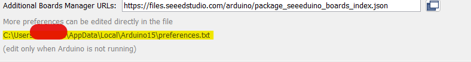

# Arduino Samples

Arduino samples can be found on the Arduino folder in the repository root. This code is built to be used for the [Seeduino LoRaWan](https://wiki.seeedstudio.com/Seeeduino_LoRAWAN/) but can serve as reference for other platforms. We have region based examples for OTAA and ABP scenarios. Please follow the [documentation](https://wiki.seeedstudio.com/Seeed_Arduino_Boards/) to set up the device

## Accessing the library files locally

There are multuple scenarios where we would want to have the librairies be modified (listed here below). To access the local installation open your arduino IDE, go to File -> Preferences and click on the line after "more preference can be edited directly in the file".



Go next to the path "packages/Seeeduino/hardware/samd/1.8.2/libraries/LoRaWan and open LoRaWan.cpp and LoRaWan.h in a text editor.


### CN library changes

To run our China samples some changes to the library need to be done as described below.

paste the following in the LoRaWan.h file:

``` C
        void setChannelON(unsigned char channel);
        void setChannelOFF(unsigned char channel);
```

and respectively in the LoRaWan.cpp file:

``` C

void LoRaWanClass::setChannelON(unsigned char channel)
{
    char cmd[32];

    memset(cmd, 0, 32);
    sprintf(cmd, "AT+CH=%d, ON\r\n", channel, (short)channel);
    sendCommand(cmd);
#if _DEBUG_SERIAL_
    loraDebugPrint(DEFAULT_DEBUGTIME);
#endif
    delay(DEFAULT_TIMEWAIT);
}

void LoRaWanClass::setChannelOFF(unsigned char channel)
{
    char cmd[32];

    memset(cmd, 0, 32);
    sprintf(cmd, "AT+CH=%d, OFF\r\n", channel, (short)channel);
    sendCommand(cmd);
#if _DEBUG_SERIAL_
    loraDebugPrint(DEFAULT_DEBUGTIME);
#endif
    delay(DEFAULT_TIMEWAIT);
}
```

### Activate Arduino debug mode

The following changes on the library can be done to enable debug mode on the seeduino device. This will get aditional details on the device transmission and operations.

paste the following in the LoRaWan.h file:

``` C
void setDebug();
```

and respectively in the LoRaWan.cpp file:

``` C
void LoRaWanClass::setDebug()
{
    sendCommand("AT+LOG=DEBUG\r\n");
}
```
