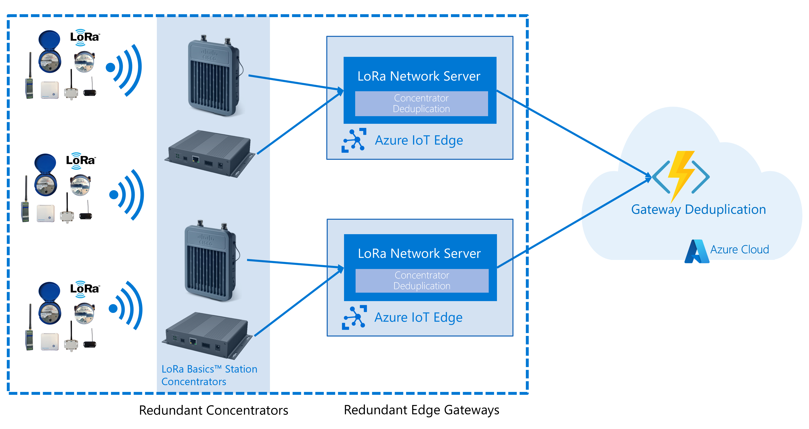
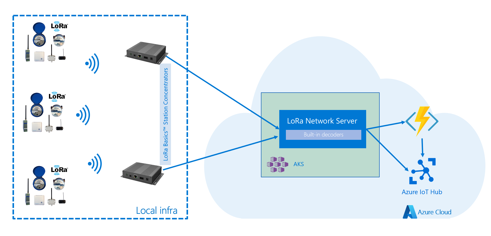

# Deployment Scenarios

The StarterKit support a wide variety of deployments, and this article will
highlight some of them.

- [Keep data on-premise](#keep-data-on-premise)
- [Redundancy with multiple concentrators and gateways](#redundancy-with-multiple-concentrators-and-gateways)
- [Deployment on Windows Server](#deployment-on-windows-server)
- [Deployment of IoT Edge in the cloud](#deployment-of-iotedge-in-the-cloud)

Other scenarios are supported, and combinations of the below scenario are possible.

## Keep data on-premise

It is possible to deploy Azure IoT Edge on your own hardware, and keep all data
in your local network or infrastructure. For example, by using a custom local
forwarding module, it is possible to route the data to a local queue or message
bus. In this case, the sensor data will never leave the on-premise network, and
connection to Azure will only be used for managing the devices, or handling the
[deduplication](../adr/007_message_deduplication.md).

## Redundancy with multiple concentrators and gateways

In a setup where sensors can reach at least one concentrator, it is possible
to get redundancy by using at least two concentrators per gateway, and at least
two gateways. In this case, the deduplication of the messages will happen in two
places: on the gateway itself for concentrator deduplication, and in the Function
for gateway deduplication ([More info on deduplication strategies](../adr/007_message_deduplication.md))

## Deployment on Windows Server

Some organizations have a limitation of only supporting Windows operating systems
on their infrastructure. In this case, it is still possible to use IoT Edge and
the StarterKit by using [*EFLOW*](https://docs.microsoft.com/en-us/azure/iot-edge/iot-edge-for-linux-on-windows?view=iotedge-2018-06),
short for "Edge for Linux on Windows". This allows you to run containerized Linux
workloads on Windows machines.

## Deployment of IoT Edge in the cloud

It is also possible to run the IoT Edge modules directly in the cloud. Either a
Linux VM to run IoT Edge directly, or on a Windows VM with EFLOW.
In fact, the full end-to-end Continuous Integration pipeline for the StarterKit
runs on EFLOW on a VM in Azure.

