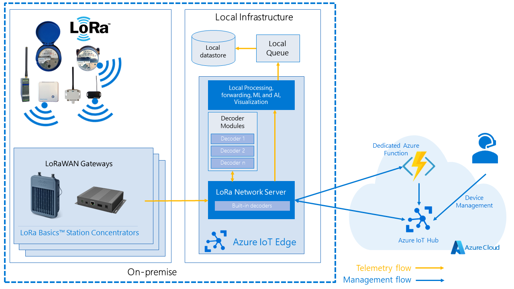

# Deployment Scenarios

The Starter Kit support a wide variety of deployments, and this article will
highlight some of them.

- [Keep data on-premise](#keep-data-on-premise)
- [Redundancy with multiple concentrators and gateways](#multiple-concentrator-with-multiple-lns)
- [Deployment on Windows Server](#deployment-on-windows-server)
- [Deployment of IoT Edge in the cloud](#deployment-in-the-cloud-outside-of-iot-edge)

Other scenarios are supported, and combinations of the below scenarios are possible.

## Keep data on-premise

It is possible to deploy Azure IoT Edge on your own hardware, and keep all data
in your local network or infrastructure. For example, by using a custom local
forwarding module, it is possible to route the data to a local queue or message
bus. In this case, the sensor data will never leave the on-premise network, and
the connection to Azure will be used for managing the devices, handling the
[deduplication](../adr/007_message_deduplication.md) or managing [concentrator
updates](station-firmware-upgrade.md) for example.

## Scalability & Availability

There are multiple strategies that you can take to improve the availability of the starter kit listed below. For the scenarios that use multiple LNS, you can further increase the availability of a concentrator by using a highly available [LNS discovery service](lns-discovery.md).

**Note**: This guide is only talking about the LBS/LNS deployment configuration. For the full solution, the function endpoint,
IoT Hub and Redis need to be taken into consideration as well. There is documentation for all of these services explaining
the different options for HA and scalability.

With the version 2.1.0 we introduced a major improvement for multi gateway deployments that
allows the LNS to scale much better when using `DeduplicationMode.Drop`.
All the deployment scenarios are now scaling to similiar levels
no matter if a multi gateway deployment is used or not.

### Single concentrator with single LNS

This is the most basic deployment you can chose. It does only deploy 1 concentrator
and one network server. Each sensor can at most reach a single concentrator.

#### Advantages

1. Simple: the deployment is simple to start with and maintain.
1. Low cost: No redundant hardware is used, which helps keeping the operational cost down.

#### Disadvantages

1. Availability: this solution has 2 points of failure: the concentrator and the
network server. Either of those can go down. The result in the worst case is loss
of messages.
1. Limited reach: Since there is only a single concentrator, you have to put all your sensor
within reach of that concentrator.
1. Reliability: message delivery might be impacted.

#### Recommended settings

| Target        | Setting               |Value|
|---------------|:----------------------|:--------|
| Device Twin   |KeepAliveTimeout       |undefined or 0 |
| Device Twin   |Deduplication          |None           |
| Device Twin   |GatewayId              |The Id of the Network Server |
| Edge Hub environment variable |[MaxConnectedClients](https://github.com/Azure/iotedge/blob/master/doc/EnvironmentVariables.md) |Depends on number of devices |
| Network server environment variable |IOTHUB_CONNECTION_POOL_SIZE |Depends on the number of devices |

### Multi concentrator with single LNS

Multiple concentrators are deployed that reach a single network server. Each sensor can reach one or multiple concentrators. Depending on the goal of the deployment (availability and/or reach).

#### Advantages

1. Relatively simple
1. Low cost
1. Partial redundancy: if the deployment is designed to ensure that each sensor can reach
at least 2 concentrators, you get higher availability than with single/single.
1. Reach: if you deploy for reach, you can get a larger support a larger geographical
deployment. To combine reach with availability, the cost will raise.

#### Disadvantages

1. Availability: Depending on the deployment, this solution has at least one single point of failure: the network server.
The result in the worst case is loss of messages.
1. Reliability: message delivery might be impacted.

#### Recommended settings

| Target        | Setting               |Value|
|---------------|:----------------------|:--------|
| Device Twin   |KeepAliveTimeout       |undefined or 0 |
| Device Twin   |Deduplication          |None           |
| Device Twin   |GatewayId              |The Id of the Network Server |
| Edge Hub Environment variable |[MaxConnectedClients](https://github.com/Azure/iotedge/blob/master/doc/EnvironmentVariables.md) |Depends on number of devices |
| Network server environment variable |IOTHUB_CONNECTION_POOL_SIZE |Depends on the number of devices |

### Multiple concentrator with Multiple LNS

Multiple concentrators are deployed that reach multiple LNS (*note* one concentrator
can only be connected to a single LNS). Each sensor can reach one or multiple concentrators. Depending on the goal of the deployment (availability and/or reach).

To get high availability concentrator deployment and assignment to LNS should be done
so that a single sensor is in range of at least 2 concentrators, both connecting to a
**different** LNS.

#### Advantages

1. Availability: If the deployment is done right, the single point of failure can
be eliminated.
1. Reliability: message delivery likelihood is increased.
1. Reach: The deployment model can be expanded

#### Disadvantages

1. Cost: all components need to be deployed and managed multiple times.
1. Complexity

#### Recommended settings

| Target        | Setting               |Value|
|---------------|:----------------------|:--------|
| Device Twin   |KeepAliveTimeout       | > 0 - depending on the sensor, this can be tuned to be the time you expect a new message to come in. Ideally not > 300 |
| Device Twin   |Deduplication          |Drop           |
| Device Twin   |GatewayId              |empty|

## Deployment on Windows Server

Some organizations only support Windows Server operating systems
on their infrastructure. In this case, it is still possible to use IoT Edge and
the Starter Kit by using [*EFLOW*](https://docs.microsoft.com/en-us/azure/iot-edge/iot-edge-for-linux-on-windows?view=iotedge-2018-06),
short for "Azure IoT Edge for Linux on Windows". This allows you to run containerized Linux
workloads on Windows machines.

## Deployment in the cloud outside of IoT Edge

It is also possible to run the LNS directly in the cloud. You can run the LNS
for example on AKS in the cloud without using IoT Edge. For detailed information
on how to deploy the LNS in the cloud without using IoT Edge, refer to
[Cloud-based Network Server configuration documentation](./lns-configuration).
This configuration enables you to reuse the same Network Servers for globally
distributed concentrators.

> In previous versious, we detailled options to perform deployment of IoT Edge in the cloud. Although this is technically still possible, **we strongly discourage it** as it has worse performance than the current alternative.

## Appendix

- [More info on deduplication strategies](../adr/007_message_deduplication.md)
