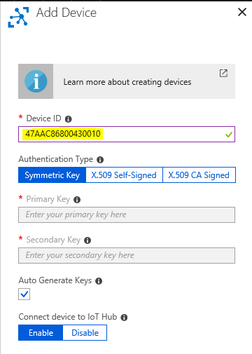

# Developer Guidance

## Directory Structure

The code is organized into three sections:

- **LoRaEngine** - a .NET 6 solution with the following folders:
  - **modules** - Azure IoT Edge modules.
  - **LoraKeysManagerFacade** - An Azure function handling device provisioning
  (e.g. LoRa network join, OTAA) with Azure IoT Hub as persistence layer.
- **Arduino** - Examples and references for LoRa Arduino based devices.
- **Template** - Contain code useful for the "deploy to Azure button"
- **Tools** - Contains tools that support the LoRaWan Gateway project
  - **BasicStation-Certificates-Generation** - Bash scripts for generating self-signed certificates for LoRa Basics Station to LoRaWan Network Server
  interactions. Read more in ["Basics Station configuration - Authentication Modes"](station-authentication-modes.md)
  - **Cli-LoRa-Device-Provisioning** - .NET 6 Command Line tool that allows to list, query, verify, insert, edit, update and delete LoRa leaf device configurations into IoT Hub
  - **Cups-Firmware-Upgrade** - Bash scripts helping Starter Kit users to generate the files needed for executing a Basics Station firmware upgrade. Read more in ["Basics Station configuration - Firmware upgrade"](station-firmware-upgrade.md)
  - **Eflow** - Includes a PowerShell script to install Edge For Linux On Windows (EFLOW) on a new Windows Server VM. The script is not intended to be run as-is, but should be seen as a collection of manual steps to be run to get eflow up and running. In case of doubts, read more in ["Create and provision an IoT Edge for Linux on Windows device using symmetric keys"](https://docs.microsoft.com/en-us/azure/iot-edge/how-to-provision-single-device-linux-on-windows-symmetric) official documentation
- **Samples** - Contains sample decoders
- **Docs** - Additional modules, pictures and documentations

## LoRaEngine

A **.NET 6** solution with the following projects:

- **modules** - Azure IoT Edge modules.
  - **LoRaBasicsStationModule** packages the Basics Station into an IoT Edge compatible docker container (See <https://github.com/lorabasics/basicstation>). If you are using a RAK833-USB, you need to build your own Basics Station docker image starting from the fork [at this link](https://github.com/danigian/basicstation). At the time of writing, SX1302 boards are supported only through SPI. If you are using a SX1302 board via USB you need to build your own Basics Station docker image starting from the fork [at this link](https://github.com/danigian/basicstation/tree/corecell)
  - **LoRaWanNetworkSrvModule** - is the LoRaWAN network server implementation.
- **LoraKeysManagerFacade** - An Azure function handling device provisioning (e.g. LoRa network join, OTAA) with Azure IoT Hub as persistence layer.

## The overall architecture

This schema represent the various components and how they interact to have a better understand of the various solution elements.


1. Once the IoT Edge engine start on the Edge device, the code modules are downloaded from the Azure Container Registry.
1. The module containing the ```LoRaWan network server``` is downloaded on the Edge device

1. The LoRaWan Network Server request status for the LoRa devices. The Azure Function ```LoraKeysManagerFacade``` is used to aquire the device identity from IoT Hub.
1. In the case you're using the demo device with the automatic deployment Azure Resource Manager (ARM) template: the Azure function ```LoraKeysManagerFacade``` will register the device ```47AAC86800430028``` into the Azure IoT Hub for you. Otherwise you need to provision a device yourself in IoT Hub: [device provisioning](../tools/device-provisioning.md)
1. The Azure function ```LoraKeysManagerFacade``` sends back the device identity to the module
1. The ```LoRaWan Network Server``` module:

    - instantiate the device on the LoRa Gateway if needed
    - gather the LoRa sensor data from the LoRaWan gateway thru the ```LoRa Basics™ Station```
    - decode the LoRa data if requested

1. Publish the LoRa sensor data to Azure IoT Hub

Another view of the architecture and a more message driven view is the following:


## Getting started with: Build and deploy LoRaEngine

The following guide describes the necessary steps to build and deploy the LoRaEngine to an [Azure IoT Edge](https://azure.microsoft.com/en-us/services/iot-edge/) installation on a LoRaWAN antenna gateway.

If you want to update a LoRa Gateway running a previous version fo our software to the current release, follow [this guide](upgrade.md)

### Used Azure services

- [Azure IoT Hub](https://azure.microsoft.com/en-us/services/iot-hub/)
- [Azure Container registry](https://azure.microsoft.com/en-us/services/container-registry/)
- [Azure Functions](https://azure.microsoft.com/en-us/services/functions/)
- [Redis Cache](https://azure.microsoft.com/en-us/services/cache/)
- [Azure Monitor](https://docs.microsoft.com/en-us/azure/azure-monitor/overview)

### Prerequisites

- Have LoRaWAN concentrator and edge node hardware ready for testing. The LoRaEngine has been tested and build for various hardware setups. However, for this guide we used the [Seeed LoRa/LoRaWAN Gateway Kit](http://wiki.seeedstudio.com/LoRa_LoRaWan_Gateway_Kit/) and concentrator and the [Seeeduino LoRaWAN](http://wiki.seeedstudio.com/Seeeduino_LoRAWAN/) as edge node.
- [Installed Azure IoT Edge](https://docs.microsoft.com/en-us/azure/iot-edge/how-to-install-iot-edge-linux-arm) on your LoRaWAN concentrator enabled edge device.
- SetUp an Azure IoT Hub instance and be familiar with [Azure IoT Edge module deployment](https://docs.microsoft.com/en-us/azure/iot-edge/quickstart-linux) mechanism.
- Be familiar with [Azure IoT Edge module development](https://docs.microsoft.com/en-us/azure/iot-edge/quickstart-linux). Note: the following guide expects that your modules will be pushed to [Azure Container registry](https://azure.microsoft.com/en-us/services/container-registry/).
- Create a new IoT Edge device in you IoT Hub with a name of your choice and the default settings.

### Create Redis Cache

- Create a `Redis Cache` in your resource group and the region you are using with a `DNS Name` of your choice and of the size `Standard C0`. Leave all other settings unchanged.
- Navigate to your Redis Cache and from Settings -> Access Keys, note the `Primary connection string (StackExchange.Redis)`.

### Setup Azure function facade and [Azure Container registry](https://azure.microsoft.com/en-us/services/container-registry/)

You have the option to either deploy the Azure Function code from your Visual Studio Code to Azure or create an empty Azure Function that points to a Zip file hosted by us, containing the function code. Follow one of the two sets of instructions that follow:

#### Deploy manually using Visual Studio

On your Visual Studio Solution, right click on the 'LoRaKeysManagerFacade' project, select 'deploy', then 'Azure' and then 'Azure function'. You should then arrive on a page where you just need to hit the deploy button to get the code deployed on Azure.


#### Deploy manually using Visual Studio Code

- Open the [Azure function folder](https://github.com/Azure/iotedge-lorawan-starterkit/tree/dev/LoRaEngine/LoraKeysManagerFacade) with Visual Studio Code with the [Azure Functions Plugin](https://marketplace.visualstudio.com/items?itemName=ms-azuretools.vscode-azurefunctions) installed. Now run the command `Azure Functions: Deploy to function app...` and provide the name of the Azure function to deploy to. If prompted, select  environment `C#` and  version `V3`.

- If you want to just deploy the function from Visual Studio Code with the root project folder `iotedge-lorawan-starterkit` open (of which the Function is a subfolder `/LoRaEngine/LoraKeysManagerFacade`), you need to run the Visual Studio Command `Azure Functions: Deploy to function app...` and then **manually** choose the folder `LoraKeysManagerFacade/bin/Release/net6.0/publish`. (Unfortunately at time of this writing we saw the behavior that VSCode is proposing the wrong folder). Building the function does not work in this way unfortunately.

#### If you choose to create an empty Azure Function pointing to our Zipped code

- Using the Azure Portal, create a new "Function App" in the resource group and location you chose for the deployment, using the default creation settings.
- Once the function is created, navigate to the `Application settings` from the Overview page.
- Add a new `Application Setting` with:

|App Settings Name|Value|
|-|-|
|WEBSITE_RUN_FROM_ZIP|The url of the .zip file containing the Function code|


#### Follow these next steps in both cases

- Configure IoT Hub and Redis connection strings in the function:

Copy your Redis Cache connection string in a connection string names `RedisConnectionString`

Copy your IoT Hub `Connection string` with owner policy applied:


Now paste it into `Application settings` -> `Connection strings` as `IoTHubConnectionString` of type `Custom`:


Also, add the previously saved `Primary connection string (StackExchange.Redis)` from your Redis Cache to the `Connection strings` of your function. Use type `Custom` again.


From the Facade Azure function, extract the `Host key` of type `_master` and save it somewhere. (We will need it in the next step)


- Create your `.env` file in the `/LoRaEngine` folder by copying the `example.env` file located [here](https://github.com/Azure/iotedge-lorawan-starterkit/blob/dev/LoRaEngine/example.env)
- Configure your `.env` file with your own [Azure Container registry](https://azure.microsoft.com/en-us/services/container-registry/) as well as the Facade access URL and credentials. Set the region to "EU" or "US" based on your location. You do not need to change any of the other settings at this point.
Those variables will be used by our [Azure IoT Edge solution template](https://github.com/Azure/iotedge-lorawan-starterkit/blob/dev/LoRaEngine/deployment.template.json).

```{bash}
...
CONTAINER_REGISTRY_ADDRESS=yourregistry.azurecr.io
CONTAINER_REGISTRY_USERNAME=yourlogin
CONTAINER_REGISTRY_PASSWORD=registrypassword
...
REGION=EU
...
FACADE_SERVER_URL=https://yourfunction.azurewebsites.net/api/
FACADE_AUTH_CODE=yourfunctionpassword
...
```

### Use a Proxy server to connect your edge gateway to Azure

> **This step is optional and should only be executed if your edge gateway needs to use a proxy server to communicate with Azure**

Follow the guide on [configuring an IoT Edge device to communicate through a proxy server](https://docs.microsoft.com/en-us/azure/iot-edge/how-to-configure-proxy-support) to:

1. Configure the Docker daemon and the IoT Edge daemon on your device to use a proxy server.
2. Configure the edgeAgent properties in the config.yaml file on your device.
3. Set environment variables for the IoT Edge runtime in the deployment manifest.

After that, add the environment variable `https_proxy` to the `LoRaWanNetworkSrvModule` in your `IoT Hub` &rarr; `IoT Edge` &rarr; `Edge Device` &rarr; `Set Modules` section.


> **End of optional proxy configuration**

### Setup concentrator with Azure IoT Edge

- Note: if your LoRa chip set is connected by SPI on raspberry PI bus don't forget to [enable it](https://www.makeuseof.com/tag/enable-spi-i2c-raspberry-pi/), (You need to restart your pi).

- Build and deploy Azure IoT Edge solution

We will use [Azure IoT Edge for Visual Studio Code](https://marketplace.visualstudio.com/items?itemName=vsciot-vscode.azure-iot-edge) extension to build, push and deploy our solution.

Make sure you are logged in to the Azure Container Registry you are using. Run `docker login <mycontainerregistry>.azurecr.io` on your development machine.

Select the architecture of your gateway (Azure IoT Edge Solution Default Platform) by clicking on the  button in the taskbar and selecting `amd64` or `arm32v7` in the command pallette.


Now, build an push the solution by right clicking [deployment.template.json](https://github.com/Azure/iotedge-lorawan-starterkit/blob/dev/LoRaEngine/deployment.template.json) and select `Build and Push IoT Edge Solution`.


After that you can push the solution to your IoT Edge device by right clicking on the device and selecting `Create Deployment for single device`. In the file dialog, navigate to the `LoRaEngine\config` folder and select the `deployment.json` file which was created during the previous step.


### Provision LoRa leaf device

The [sample code](https://github.com/Azure/iotedge-lorawan-starterkit/blob/dev/Arduino/EU/TemperatureOtaaLora/TemperatureOtaaLora.ino) used in this example is based on [Seeeduino LoRaWAN](http://wiki.seeedstudio.com/Seeeduino_LoRAWAN/) with a [Grove - Temperature Sensor](http://wiki.seeedstudio.com/Grove-Temperature_Sensor_V1.2/). It sends every 30 seconds its current temperature reading and prints out a Cloud-2-Device message if one is transmitted in its receive window.

The sample has configured the following sample [device identifiers and credentials](https://www.thethingsnetwork.org/lorawan/security.html):

- DevEUI: `47AAC86800430010`
- AppEUI: `BE7A0000000014E3`
- AppKey: `8AFE71A145B253E49C3031AD068277A3`

You will need your own identifiers when provisioning the device.

Look out for these code lines:

```arduino
lora.setId(NULL, "47AAC86800430010", "BE7A0000000014E3");
lora.setKey(NULL, NULL, "8AFE71A145B253E49C3031AD068277A3");
```
<!-- markdown-link-check-disable -->
To provisioning a device in Azure IoT Hub with these identifiers and capable to [decode](https://github.com/Azure/iotedge-lorawan-starterkit/blob/dev/LoRaEngine/modules/LoRaWanNetworkSrvModule/LoRaWan.NetworkServer/LoRaPayloadDecoder.cs) simple value payload into Json you have to create a device with:

Device Id: `47AAC86800430010` and Device Twin's deired properties:

```json
"desired": {
  "AppEUI": "BE7A0000000014E3",
  "AppKey": "8AFE71A145B253E49C3031AD068277A3",
  "SensorDecoder": "DecoderValueSensor"
}
```

You can  provision the device manually in the Azure portal or use the provided [Command Line Interface Provisioning Tool to list, query, verify add, update, and remove  devices](../tools/device-provisioning.md).

<!-- markdown-link-check-enable -->

The command to execute is:

```powershell
dotnet run -- add --type OTAA --deveui 47AAC86800430010 --appeui BE7A0000000014E3 --appkey 8AFE71A145B253E49C3031AD068277A3 --decoder DecoderValueSensor
```

To manually provision the device in IoT Hub, do the following:




### Device to Cloud and Cloud to Device messaging in action

As soon as you start your device you should see the following:

- [DevAddr, AppSKey and NwkSKey](https://www.thethingsnetwork.org/lorawan/security.html) are generated and stored in the Device Twin, e.g.:

```json
"desired": {
    "AppEUI": "BE7A0000000014E3",
    "AppKey": "8AFE71A145B253E49C3031AD068277A3",
    "SensorDecoder": "DecoderValueSensor",
    "AppSKey": "5E8513F64D99A63753A5F0DBB9FB9F91",
    "NwkSKey": "C0EF4B9495BD4A4C32B42438CD52D4B8",
    "DevAddr": "025DEAAE",
    "DevNonce": "D9B6"
  }
```

- If you follow the logs of the network server module (e.g. `sudo iotedge logs LoRaWanNetworkSrvModule -f`) you can follow the LoRa device join:

```text
{"rxpk":[{"tmst":3831950603,"chan":2,"rfch":1,"freq":868.500000,"stat":1,"modu":"LORA","datr":"SF7BW125","codr":"4/5","lsnr":8.5,"rssi":-30,"size":23,"data":"AOMUAAAAAHq+EABDAGjIqkfZtkroyCc="}]}
Join Request Received
{"txpk":{"imme":false,"data":"IE633dznxvgA89ZTkH1jET0=","tmst":3836950603,"size":17,"freq":868.5,"rfch":0,"modu":"LORA","datr":"SF7BW125","codr":"4/5","powe":14,"ipol":true}}
Using edgeHub as local queue
Updating twins...
Join Accept sent
TX ACK RECEIVED
```

- Every 30 seconds the temperature is transmitted by the device, e.g.:

```json
{
  "time": null,
  "tmms": 0,
  "tmst": 4226472308,
  "freq": 868.5,
  "chan": 2,
  "rfch": 1,
  "stat": 1,
  "modu": "LORA",
  "datr": "SF12BW125",
  "codr": "4/5",
  "rssi": -33,
  "lsnr": 7.5,
  "size": 18,
  "data": {
    "temperature": 18.78
  },
  "EUI": "47AAC86800430010",
  "gatewayId": "berry2",
  "edgets": 1534253192857
}
```

Note: an easy way to follow messages send from the device is again with VSCode: right click on the device in the explorer -> `Start Monitoring D2C Message`.

This is how a complete transmission looks like:


You can even test sending Cloud-2-Device message (e.g. by VSCode right click on the device in the explorer -> `Send C2D Message To Device`).

The Arduino example provided above will print the message on the console. Keep in mind that a [LoRaWAN Class A](https://www.thethingsnetwork.org/lorawan/) device will only receive after a transmit, in our case every 30 seconds.

### Observability

Refer to the [Observability](observability.md) guide if you want to learn about how to use the starter kit observability features.

### LNS discovery

The LNS protocol specifies that the first request an LBS makes is to the `/router-info` discovery endpoint. The LNS from the starter kit implements the `/router-info` endpoint and redirects any requests to that endpoint forward to the `/router-data` endpoint on the same LNS.

In addition to the discovery endpoint on the LNS itself, we also support a standalone discovery service, which you can use to distribute LBS connections to different LNS. The discovery service is a .NET application, and its implementation is part of the `LoRaWan.NetworkServerDiscovery` project.

The discovery service relies on configuration from IoT Hub module twins to associate each LBS with a set of LNS to which it may connect to. For this the configuration needs to take into account possible network boundaries - by defining these networks you can control which LBS should connect to which LNS. For this you need to configure your LBS twin in IoT Hub as follows:

```json
{
  ...,
  "tags": {
    "network": "<network-id>"
  },
  ...
}
```

The network ID may only consist of alphanumeric characters. After you configured the LBS, you need to also configure your LNS with the same network. The LNS twin furthermore needs to contain the IP/DNS of the host, hence the twin of the LNS *module* should look like:

```json
{
  ...,
  "tags": {
    "network": "<network-id>"
  },
  ...,
  "properties": {
    "desired": {
      "hostAddress": "wss://mylns:5001",
      ...
    }
  }
}
```

Keep in mind that the `hostAddress` value must include the scheme and the host name. In case you omit the port, the defaults of the protocol will be used.

!!! note
    The discovery endpoint distributes LBS to LNS using a round-robin distribution mechanism. It will always try the same LNS per LBS first. Hence, it can be used for an active/passive scenario, but not to distribute load more evenly across different LNS.

!!! note
    The configuration values of the network name of a station, respectively of the set of LNS in a given network, are cached by the discovery endpoint for six hours.
    If you updated the configuration, make sure to restart the discovery service to ensure that the cache is refreshed.

You can choose to deploy the discovery service either on-prem or in the cloud. For both deployment strategies, you can configure the following behavior:

- The log level can be configured by setting the `Logging__LogLevel__Default` environment variable. For more fine-grained configuration of the console log level, refer to [Logging in .NET Core and ASP.NET Core](https://docs.microsoft.com/en-us/aspnet/core/fundamentals/logging/?view=aspnetcore-6.0#set-log-level-by-command-line-environment-variables-and-other-configuration).
- You can use Application Insights by setting the `APPINSIGHTS_INSTRUMENTATIONKEY` environment variable. The log levels for Application Insights can be configured similarly to the default log levels, but by using the environment variables `Logging__ApplicationInsights__LogLevel__<Default|...>`.
- You can configure on which URLs the service is listening by setting the environment variable `ASPNETCORE_URLS`.

#### Deployment in Azure

We recommend that you use an Azure App Service to run the discovery service in the cloud. You can follow the [App Service Quickstart](https://docs.microsoft.com/en-us/azure/app-service/quickstart-dotnetcore?tabs=net60&pivots=development-environment-cli) for instructions how to deploy an ASP.NET Core app in an Azure App Service. When using an App Service, make sure that you:

- [Enable the system assigned managed identity](https://docs.microsoft.com/en-us/azure/app-service/overview-managed-identity?tabs=portal%2Chttp#add-a-system-assigned-identity)
- Assign a role to the system assigned identity which allows it to query the IoT Hub twins, e.g. IoT Hub Twin Contributor.
- Specify the `IotHubHostName` environment variable, such that it points to your IoT Hub.

#### On-premises deployment

When deploying the discovery service on-premises, please read how to [Host ASP.NET Core on Windows with IIS](https://docs.microsoft.com/en-us/aspnet/core/host-and-deploy/iis/?view=aspnetcore-6.0) (or any other hosting strategy you may want to use).

- You must specify the IoT Hub connection string by setting the `ConnectionStrings__IotHub` environment variable, since you cannot use managed identities with an on-premises deployment. The discovery endpoint exposes metrics in Prometheus format.
- You can configure the certificates that should be used by the discovery endpoint as described in the [Minimal APIs overview](https://docs.microsoft.com/en-us/aspnet/core/fundamentals/minimal-apis?view=aspnetcore-6.0#specify-https-using-a-custom-certificate). Instead of using the `appsettings.json`, you can use environment variables of the same structure `Kestrel__Certificates__Default__<Path|KeyPath|...>`.

## Debugging in Visual Studio, outside of IoT Edge and Docker

It is possible to run the LoRaEngine locally from Visual Studio in order to enable a better debugging experience. Here are the steps you will need to follow in order to enable this feature:

1. You need to point the `cups.uri` and/or the `tc.uri` Basics Station files to the endpoints exposed by your machine <!-- markdown-link-check-disable --> (i.e. `https://IP_ADDRESS:5002` and `wss://IP_ADDRESS:5001` when using a server PFX certificate or `ws://IP_ADDRESS:5000`) <!-- markdown-link-check-enable -->

1. If you are using a Wireless network in Windows, make sure it is configured as a private network in your Windows settings. Otherwise, the Windows Firewall could bock the incoming packets.

1. Open the properties of the project [LoRaWanNetworkServerModule](https://github.com/Azure/iotedge-lorawan-starterkit/tree/dev/LoRaEngine/modules/LoRaWanNetworkSrvModule/LoRaWanNetworkSrvModule) and set the following Environment Variables under the Debug tab: <!-- markdown-link-check-disable -->

    ```env
    'IOTEDGE_IOTHUBHOSTNAME': <your iot hub hostname>.azure-devices.net
    'ENABLE_GATEWAY': false
    'FACADE_SERVER_URL': <http://localhost:7071/api/> (when debugging locally or any other URL of the Azure function you want to use)
    'IOTEDGE_DEVICEID': The name of your PC
    'FACADE_AUTH_CODE': (only needed for deployed Azure Function) the code for authenticating and authorizing requests
    'LOG_LEVEL': 1 or Debug (optional, to activate most verbose logging level)
    ```

1. <!-- markdown-link-check-enable --> Add a `local.settings.json` file to the project [LoRaKeysManagerFacade](https://github.com/Azure/iotedge-lorawan-starterkit/tree/dev/LoRaEngine/LoraKeysManagerFacade) containing:

    ```json
    {
      "IsEncrypted": false,
      "values": {
        "AzureWebJobsStorage": "<Connection String of your deployed blob storage>",
        "WEBSITE_CONTENTSHARE": "<Name of your Azure function>"

      },
      "ConnectionStrings": {
        "IoTHubConnectionString": "<Connection string of your IoT Hub Owner (go to keys -> IoT Hub owner and select the connection string)>",
        "RedisConnectionString": "<Connection string of your Redis Cache>"
      }
    }
    ```

1. Right click on your solution and select properties, select multiple startup projects. Start `LoRaWanNetworkSrvModule` and `LoRaKeysManagerFacade`.

1. If you hit start in your VS solution, you will receive messages directly from your LoRa Basics™ Station. You will be able to debug directly from your computer.

Happy Debugging!
